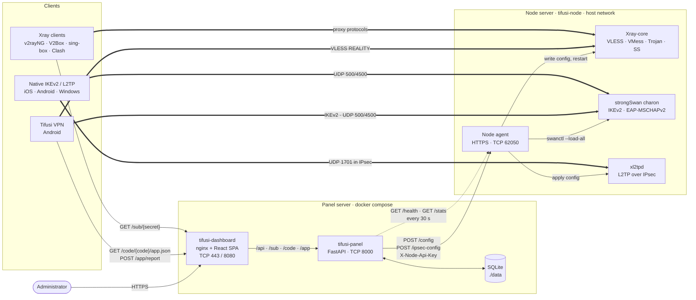
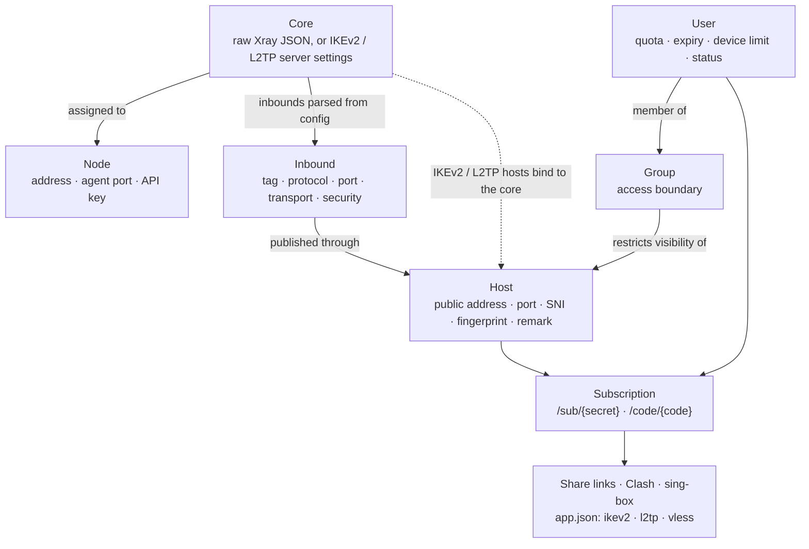
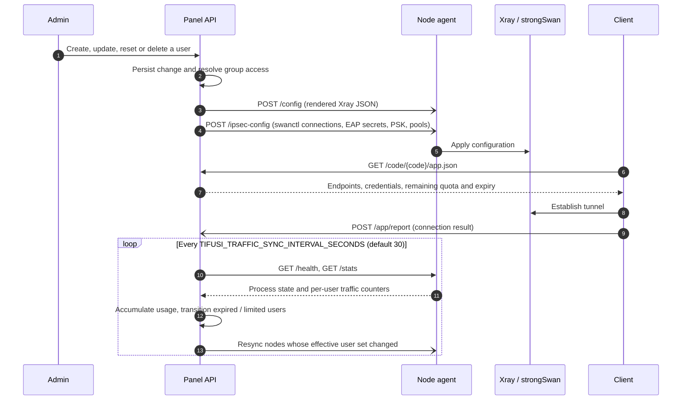

<p align="center">
  
</p>

<h1 align="center">TIFUSI PANEL</h1>

<hr>

<p align="center">
  <a href="https://github.com/javadtifusi-eng/Tifusi-Panel/stargazers"></a>
  
  <a href="https://t.me/javadheydeari"></a>
  
  <a href="LICENSE"></a>
</p>

<p align="center">
  
  
  
  
  
  
  
</p>

<p align="center">
   <a href="README.md">English</a> &nbsp;·&nbsp;  <b>فارسی</b> &nbsp;·&nbsp;  <a href="README.ru.md">Русский</a>
</p>

<hr>

<div dir="rtl">

تیفوسی پنل یک سامانه‌ی کنترل خودمیزبان برای زیرساخت پروکسی و VPN است. یک نمونه‌ی پنل، کاربران، سیاست دسترسی و پیکربندی هسته‌ها را نگهداری می‌کند، پیکربندی هر نود را تولید می‌کند و آن را از طریق یک API مبتنی بر HTTPS و احراز هویت‌شده به تعداد دلخواه نود راه دور ارسال می‌کند. روی نودها Xray-core برای VLESS، VMess، Trojan و Shadowsocks، و strongSwan به‌همراه xl2tpd برای IKEv2/IPsec و L2TP/IPsec اجرا می‌شود. نقاط اشتراک، لینک‌های اشتراک‌گذاری، پروفایل‌های Clash و sing-box و یک پروفایل JSON ساخت‌یافته برای کلاینت Tifusi VPN ارائه می‌کنند. WireGuard پشتیبانی نمی‌شود.

</div>

<p align="center">
  
  <br /><br />
  
</p>

<div dir="rtl">

## تازه‌های نسخه‌ی ۱.۳

- **محدودیت واقعی اتصال.** محدودیت دستگاه روی خود نودها برای Xray، IKEv2 و L2TP اعمال می‌شود: دستگاه‌های وصل، وصل می‌مانند و دستگاه اضافه تا خالی شدن جا منتظر می‌ماند.
- **رمز اختصاصی IKEv2/L2TP.** رمز ورود اختیاری برای هر کاربر، جدا از کلید لینک اشتراک.
- **پورت دلخواه.** پورت HTTPS داشبورد قابل تغییر است و در هر سؤال پورت، گزینه‌ی پورت تصادفی آزاد هست.
- **مدیریت نود.** دستور `tifusi node` روی سرور نود، و گزینه‌ی «حذف نود» در `tifusi panel`.
- **رفع اشکال.** گیر کردن نود در حالت pending در نسخه‌ی MySQL، کرش build تازه، و پاک نشدن اطلاعات هنگام حذف پنل.

فهرست کامل تغییرات: [CHANGELOG.md](CHANGELOG.md).

</div>

<div dir="rtl">

## معماری

### اجزا و مسیر داده

</div>



<div dir="rtl">

فلش‌های پیوسته درخواست‌های لایه‌ی کنترل، فلش‌های نقطه‌چین پایش دوره‌ای و فلش‌های ضخیم ترافیک لایه‌ی داده را نشان می‌دهند. پنل ترافیک کاربران را عبور نمی‌دهد و کلاینت‌ها مستقیماً به نشانی نودهایی که در هاست‌ها منتشر شده‌اند متصل می‌شوند.

### مدل پیکربندی

</div>



<div dir="rtl">

هاستی که به هیچ گروهی تعلق ندارد برای همه‌ی کاربران قابل مشاهده است. پس از اتصال هاست به یک یا چند گروه، آن هاست فقط برای اعضای همان گروه‌ها در اشتراک و پیکربندی نود درج می‌شود.

### چرخه‌ی همگام‌سازی نود

</div>



<div dir="rtl">

### امنیت ارتباط پنل و نود

- عامل نود با یک گواهی خودامضا که در نخستین اجرا تولید می‌شود (`backend/node_agent/tls.py`) روی HTTPS سرویس می‌دهد. به این ترتیب اعتبارنامه‌ها و اسرار ارسالی در مسیر رمزنگاری می‌شوند.
- هر درخواست کلید اختصاصی نود را در سرآیند `X-Node-Api-Key` حمل می‌کند. پنل گواهی عامل را اعتبارسنجی نمی‌کند، بنابراین کلید API اعتبارنامه‌ی اصلی است. TLS دوطرفه هنوز پیاده‌سازی نشده است.
- کانتینر نود با `--network host` اجرا می‌شود تا Xray بتواند پورت‌هایی را که پس از راه‌اندازی کانتینر تعریف می‌شوند اشغال کند و پورت‌های UDP 500، 4500 و 1701 روی نشانی عمومی به charon و xl2tpd برسند.

## قابلیت‌ها

- **کاربران.** ایجاد، فعال‌سازی، غیرفعال‌سازی و حذف به‌صورت تکی و گروهی. سهمیه‌ی داده با حسابرسی مصرف، انتقال خودکار به وضعیت‌های `expired` و `limited`، حساب‌های در انتظار که مدت اعتبارشان از نخستین اتصال آغاز می‌شود، محدودیت تعداد دستگاه و قالب‌های قابل استفاده‌ی مجدد. محدودیت دستگاه روی خود نودها هم به‌صورت اتصال هم‌زمان برای Xray، IKEv2 (حالت EAP) و L2TP اعمال می‌شود: دستگاه‌هایی که وصل هستند وصل می‌مانند و دستگاه اضافه تا خالی شدن جا منتظر می‌ماند. در Xray هر IP یک دستگاه حساب می‌شود و بررسی هم کاربر و هم IP را در نظر می‌گیرد، پس مشتریانی که پشت یک IP اپراتور هستند روی هم اثر نمی‌گذارند. Hysteria2 بیرون از نودها اجرا می‌شود و IKEv2 در حالت PSK شناسه‌ی جدا برای هر کاربر ندارد، پس این دو را نمی‌شود این‌طور محدود کرد.
- **هسته‌ها (Cores).** یا یک پیکربندی کامل Xray به‌صورت JSON همراه با ویرایشگرهای ساخت‌یافته برای routing، outbounds و DNS، یا پارامترهای سرور IKEv2/L2TP. هر هسته به یک یا چند نود تخصیص داده می‌شود.
- **هاست‌ها.** نقاط انتهایی عمومی برای VLESS، VMess، Trojan، Shadowsocks، Hysteria2، L2TP و IKEv2. هاست‌های مبتنی بر Xray به یک inbound استخراج‌شده از پیکربندی هسته ارجاع می‌دهند و پارامترهای transport، security و REALITY را از آن به ارث می‌برند. هاست‌های L2TP از PSK مشترک استفاده می‌کنند. هاست‌های IKEv2 سرور را با گواهی X.509 (به‌طور پیش‌فرض خودامضا، یا زنجیره‌ی صادرشده توسط CA) و هر کاربر را با EAP-MSCHAPv2 احراز هویت می‌کنند.
- **گروه‌ها.** کنترل دسترسی اعمال‌شونده. عضویت در گروه هم لینک‌های دریافتی کاربر و هم اعتبارنامه‌های درج‌شده در پیکربندی نود را تعیین می‌کند.
- **اسکنر مقصد REALITY.** تأخیر حدود ۱۶۰ دامنه‌ی SNI را اندازه‌گیری کرده و سریع‌ترین گزینه را در فرم هاست پیشنهاد می‌کند.
- **اشتراک‌ها.** URIهای `vless://`، `vmess://`، `trojan://`، `ss://` و `hysteria2://` برای هر هاست؛ پارامترهای اتصال L2TP و IKEv2؛ پروفایل `.mobileconfig` برای IKEv2؛ یک نشانی اشتراک واحد با کد QR. کلاینت‌های خانواده‌ی Clash و sing-box از روی User-Agent تشخیص داده شده و پروفایل بومی دریافت می‌کنند.
- **نمایندگان.** مالک پنل در صفحه‌ی «نمایندگان» برای هر نماینده حساب ورود جداگانه می‌سازد و پروتکل‌های مجاز و سقف اختیاری تعداد کاربر، حجم کل یا هر دو را تعیین می‌کند. نماینده فقط کاربران خود را می‌بیند و مدیریت می‌کند، برای هر کاربر یکی از پروتکل‌های مجاز را انتخاب می‌کند، سهم باقی‌مانده‌ی خود را در صفحه‌ی کاربران می‌بیند و به نودها، هاست‌ها، هسته‌ها، تانل‌ها، گروه‌ها و تنظیمات دسترسی ندارد.
- **پروفایل Tifusi VPN.** مسیرهای `GET /sub/{secret}/app.json` و `GET /code/{code}/app.json` نقاط انتهایی IKEv2، L2TP و VLESS را همراه با سهمیه و تاریخ انقضا بازمی‌گردانند. نتایج اتصال که کلاینت به `/app/report` ارسال می‌کند برای هر کاربر و در بخش فعالیت‌های داشبورد نمایش داده می‌شود.
- **نودها.** ثبت نود یک فرمان نصب یک‌خطی متصل به کلید نود تولید می‌کند. پس از نخستین همگام‌سازی موفق، پایش سلامت و جمع‌آوری ترافیک به‌صورت پیوسته انجام می‌شود.
- **تونل‌ها.** یک سرور خارجی را از طریق یک رله در شبکه‌ی محدود منتشر می‌کند، به‌طوری که سرور خارجی به هیچ پورت ورودی باز نیاز ندارد. پنل فرمان نصب هر دو سمت را تولید کرده و بر اساس اندازه‌گیری زنده‌ی تأخیر، transport مناسب را پیشنهاد می‌کند.
- **مدیریت.** یک حساب مالک و مدیران اضافی با مجوزهای محدود. مدیران محدود فقط کاربرانی را که خود ایجاد کرده‌اند مشاهده می‌کنند. هر مدیر می‌تواند برای خودکارسازی کلید API صادر کند.
- **اعلان‌ها.** Telegram، Discord و webhook عمومی برای تغییر وضعیت کاربران و نودها.
- **تنظیمات.** نشانی عمومی، رمز مدیر، بارگذاری گواهی TLS یا صدور گواهی Let's Encrypt، و پشتیبان‌گیری و بازیابی پایگاه داده، همگی بدون استقرار مجدد.
- **رابط کاربری.** React 18، Vite و Tailwind CSS؛ بومی‌سازی فارسی (راست‌به‌چپ) و انگلیسی؛ قلم‌های Vazirmatn و Poppins به‌صورت خودمیزبان.

کارهای برنامه‌ریزی‌شده و موارد کنارگذاشته‌شده در [`ROADMAP.md`](ROADMAP.md) ثبت شده‌اند.

## ساختار مخزن

</div>

| Path | Contents |
| --- | --- |
| `backend/app` | FastAPI application: routers, SQLAlchemy models, Xray config builder, subscription renderers, node sync, traffic accounting |
| `backend/alembic` | Database migrations |
| `backend/cli` | `tifusi-cli`, including first-run admin key generation |
| `backend/node_agent` | Node agent service, strongSwan/xl2tpd integration, node Dockerfile |
| `backend/tunnel_agent` | Relay agent for the Tunnels feature (Go) |
| `frontend` | React dashboard and nginx image |
| `install.sh`, `install-node.sh` | Panel and node installers |
| `manage.sh` | Operations menu, installed as `/usr/local/bin/tifusi-panel` and run as `tifusi panel` |
| `scripts/tifusi` | Shared `tifusi` launcher for Tifusi Panel, Tifusi Bot and the Tifusi VPN app |
| `.github/workflows/build-images.yml` | Builds and publishes panel, dashboard and node images to GHCR |

<div dir="rtl">

## پیش‌نیازها

### مشخصات سرور

| نقش | حداقل | پیشنهادی |
| --- | --- | --- |
| پنل | ۱ هسته‌ی CPU، ۱ گیگابایت رم، ۱۰ گیگابایت دیسک | ۲ هسته‌ی CPU، ۲ گیگابایت رم، ۲۰ گیگابایت دیسک |
| نود | ۱ هسته‌ی CPU، ۵۱۲ مگابایت رم، ۱۰ گیگابایت دیسک | ۱ هسته‌ی CPU، ۱ گیگابایت رم، ۲۰ گیگابایت دیسک |
| پنل و نود روی یک سرور | ۱ هسته‌ی CPU، ۲ گیگابایت رم، ۱۵ گیگابایت دیسک | ۲ هسته‌ی CPU، ۲ گیگابایت رم، ۲۵ گیگابایت دیسک |
| پنل، نسخه‌ی حرفه‌ای (MySQL) | ۲ هسته‌ی CPU، ۲ گیگابایت رم، ۲۰ گیگابایت دیسک | ۲ هسته‌ی CPU، ۴ گیگابایت رم، ۴۰ گیگابایت دیسک |

اندازه‌گیری روی یک نصب در حال کار: کانتینر پنل حدود ۱۰۰ مگابایت رم، داشبورد حدود ۶ مگابایت و نود حدود ۵۰ مگابایت مصرف می‌کند و ایمیج‌ها حدود ۱ گیگابایت از دیسک را می‌گیرند. دیسک بزرگ‌تر پیشنهادی برای به‌روزرسانی ایمیج‌ها، لاگ‌ها و بکاپ‌هاست. نیاز CPU و باند نود را حجم ترافیک تعیین می‌کند، نه تعداد کاربران.

### سیستم‌عامل و معماری

- سیستم‌عامل: Ubuntu 22.04/24.04 یا Debian 11/12 (نصب‌کننده‌ها از `apt-get` استفاده می‌کنند). توزیع‌های دیگر لینوکس با نصب دستی Docker کار می‌کنند.
- معماری: x86_64 (amd64). ایمیج‌های آماده فقط برای amd64 منتشر می‌شوند؛ روی معماری‌های دیگر ایمیج‌ها به‌صورت محلی ساخته می‌شوند که بسیار بیشتر طول می‌کشد.
- دسترسی root و نشانی IPv4 عمومی.

### شبکه

- پنل: برای TLS داشتن رکورد DNS متصل به سرور توصیه می‌شود. برای گرفتن گواهی رایگان Let's Encrypt پورت ۸۰ باید در دسترس باشد.
- نود: IKEv2 به پورت‌های UDP 500 و 4500 نیاز دارد؛ L2TP علاوه بر آن به UDP 1701 و ماژول‌های کرنل `l2tp_ppp` و `ppp_generic` روی میزبان نیاز دارد.
- ساخت محلی ایمیج‌ها به دسترسی خروجی به releaseهای Xray-core در GitHub و آرشیو سورس strongSwan نیاز دارد.

## نصب

> **حداقل سرور برای پنل:** ۱ هسته‌ی CPU، ۱ گیگابایت رم، ۱۰ گیگابایت فضای دیسک.
> **برای نصب و مدیریت راحت:** ۲ هسته‌ی CPU، ۲ گیگابایت رم، ۲۰ گیگابایت فضای دیسک، با Ubuntu 22.04/24.04 یا Debian 11/12 روی x86_64.
> اگر پنل و نود روی یک سرور باشند: حداقل ۲ گیگابایت رم و ۲۵ گیگابایت فضای دیسک. جزئیات در بخش «پیش‌نیازها».
> **نسخه‌ی حرفه‌ای (MySQL):** ۲ هسته‌ی CPU، حداقل ۲ گیگابایت رم (پیشنهادی ۴ گیگابایت)، ۲۰ گیگابایت فضای دیسک.

### پنل — نسخه‌ی عادی (SQLite)

</div>

```bash
bash -c "$(curl -fsSL https://raw.githubusercontent.com/javadtifusi-eng/Tifusi-Panel/main/install.sh)"
```

<div dir="rtl">

نصب‌کننده Docker را آماده می‌کند، مخزن را clone می‌کند، `TIFUSI_SECRET_KEY` را تولید می‌کند، در صورت تمایل برای دامنه‌ای که به سرور اشاره می‌کند گواهی Let's Encrypt صادر می‌کند و مجموعه را با Docker Compose راه‌اندازی می‌کند. فرمان مدیریتی `tifusi panel` نیز نصب می‌شود.

### پنل — نسخه‌ی حرفه‌ای (MySQL)

```bash
bash -c "$(curl -fsSL https://raw.githubusercontent.com/javadtifusi-eng/Tifusi-Panel/main/install.sh)" -- --pro
```

همان پنل، با این تفاوت که همه‌ی اطلاعات (کاربرها، نودها، هاست‌ها، گروه‌ها، هسته‌ها و تنظیمات) به‌جای فایل SQLite داخلی در یک کانتینر MySQL 8.4 نگهداری می‌شود. نصب‌کننده رمزهای MySQL را خودکار می‌سازد، MySQL فقط از شبکه‌ی داخلی Docker در دسترس است و داده‌هایش در پوشه‌ی `mysql-data/` ذخیره می‌شود. برای تعداد کاربر زیاد یا وقتی دیتابیس استاندارد برای مدیریت و پشتیبان‌گیری می‌خواهید، این نسخه را انتخاب کنید؛ `tifusi panel backup` و `tifusi panel restore` خروجی MySQL را هم شامل می‌شوند. نصب نود برای هر دو نسخه یکسان است.

### نود

ابتدا نود را در صفحه‌ی **Nodes** ایجاد کنید تا کلید API آن به دست آید، سپس روی سرور نود اجرا کنید:

</div>

```bash
bash -c "$(curl -fsSL https://raw.githubusercontent.com/javadtifusi-eng/Tifusi-Panel/main/install-node.sh)" -- <API_KEY> [PORT]
```

<div dir="rtl">

مقدار پیش‌فرض `PORT` برابر `62050` است. اسکریپت ایمیج آماده‌ی نود را دریافت می‌کند (و در صورت در دسترس نبودن، آن را به‌صورت محلی می‌سازد)، ماژول‌های کرنل لازم را بارگذاری می‌کند و کانتینر `tifusi-node` را روی شبکه‌ی میزبان اجرا می‌کند. برای ارسال پیکربندی اولیه، در پنل گزینه‌ی **Sync** را انتخاب کنید.

همچنین دستور `tifusi node` روی سرور نود نصب می‌شود؛ منوی مخصوص همان سرور با گزینه‌های `status`، `logs`، `restart` و `uninstall` که به‌صورت `tifusi node <action>` هم کار می‌کند. حذف کامل یک نود دو مرحله دارد، چون پنل هیچ‌وقت از راه دور چیزی را روی سرور نود متوقف نمی‌کند: `tifusi node uninstall` روی خود نود ایجنت را پاک می‌کند، و گزینه‌ی **Remove a node from this panel** در `tifusi panel` (یا صفحه‌ی **Nodes**) نود را از پنل حذف می‌کند.

### راه‌اندازی اولیه

</div>

<div dir="rtl">

۱. داشبورد را باز کنید. در صورتی که هیچ مدیری وجود نداشته باشد، صفحه‌ی ورود روال راه‌اندازی را ارائه می‌کند.

۲. روی سرور پنل یک کلید راه‌اندازی یک‌بارمصرف تولید کنید:

</div>

```bash
docker exec -it tifusi-panel tifusi-cli generate-admin-key
```

<div dir="rtl">

۳. کلید را وارد کرده و نام کاربری و رمز حساب مالک را تعیین کنید.

## عملیات

فرمان `tifusi panel` بدون آرگومان یک منوی تعاملی و با آرگومان یک عملیات مشخص را اجرا می‌کند:

</div>

| Command | Action |
| --- | --- |
| `tifusi panel update` | Update to the latest release and recreate the containers |
| `tifusi panel status` | Show container state |
| `tifusi panel logs` | Follow container logs |
| `tifusi panel restart` | Restart the stack |
| `tifusi panel port` | Change the panel API and dashboard ports |
| `tifusi panel ssl` | Issue a Let's Encrypt certificate |
| `tifusi panel key` | Generate a new administrator setup key |
| `tifusi panel backup` / `tifusi panel restore` | Export or restore the database |
| `tifusi panel uninstall` | Remove the installation |

<div dir="rtl">

فرمان `tifusi` یک راه‌انداز مشترک با [Tifusi Bot](https://github.com/javadtifusi-eng/Tifusi-Bot) است: `tifusi bot` منوی نصب‌کننده‌ی ربات را باز می‌کند و `tifusi app` آخرین نسخه‌ی اپلیکیشن اندروید Tifusi VPN را همراه با لینک دانلود نمایش می‌دهد. اگر روی سرور تنها یکی از دو مؤلفه‌ی پنل یا ربات نصب باشد، فرمان `tifusi` بدون زیرفرمان همان مؤلفه را باز می‌کند؛ از این رو `tifusi update` همچنان کار می‌کند.

</div>

<div dir="rtl">

## مرجع استقرار

### Docker Compose

</div>

```bash
cp .env.example .env    # set TIFUSI_SECRET_KEY; set TIFUSI_PUBLIC_URL when behind a reverse proxy
docker compose up -d --build
```

| Service | Container | Ports |
| --- | --- | --- |
| Panel API | `tifusi-panel` | `8000` (API), `80` (ACME HTTP-01 challenge only) |
| Dashboard | `tifusi-dashboard` | `8080` (HTTP), `443` (HTTPS) |

<div dir="rtl">

همه‌ی پورت‌های بالا هنگام نصب پرسیده می‌شوند و بعداً با `tifusi panel port` قابل تغییرند؛ در هر پرسش می‌توانید `r` بزنید تا یک پورت آزاد تصادفی انتخاب شود. تنها استثنا پورت `80` است که ثابت می‌ماند، چون پنل چالش HTTP-01 لتزاینکریپت را روی آن پاسخ می‌دهد. پورت HTTPS با `TIFUSI_DASHBOARD_HTTPS_PORT` تعیین می‌شود و پیش‌فرض آن `443` است؛ برای سروری که پشت پروکسی Cloudflare قرار دارد یکی از `2053`، `2083`، `2087`، `2096` یا `8443` را بگذارید و `TIFUSI_PUBLIC_URL` را هم متناسب با آن به‌روز کنید، چون نشانی `https://host` بدون پورت فقط `443` را می‌رساند.

داده‌های SQLite در `./data` ذخیره می‌شوند. متغیر `TIFUSI_PUBLIC_URL` نشانی پایه‌ی لینک‌های اشتراک را تعیین می‌کند؛ در صورت تنظیم‌نشدن، لینک‌ها از سرآیند `Host` درخواست ساخته می‌شوند که در حالت قرارگرفتن پنل پشت پروکسی برای کلاینت‌ها قابل دسترس نیست. این مقدار بعداً از بخش **Settings** در زمان اجرا قابل تغییر است.

### TLS روی داشبورد

کانتینر داشبورد TLS را روی پورت 443 خاتمه می‌دهد و مسیرهای `/api/`، `/sub/`، `/code/` و `/app/` را به پنل پروکسی می‌کند. فایل‌های `fullchain.pem` و `privkey.pem` از پوشه‌ی `./certs` خوانده می‌شوند و این پوشه به‌طور پیوسته پایش می‌شود؛ تغییر گواهی بدون راه‌اندازی مجدد اعمال می‌شود. گواهی را می‌توان از طریق نصب‌کننده، بخش **Settings → SSL Certificate** یا قراردادن دستی در `./certs` فراهم کرد.

### TLS مستقیم روی API

در استقرارهای بدون کانتینر داشبورد، uvicorn می‌تواند TLS را مستقیماً خاتمه دهد:

</div>

```bash
TIFUSI_SSL_CERTFILE=/app/certs/fullchain.pem
TIFUSI_SSL_KEYFILE=/app/certs/privkey.pem
```

<div dir="rtl">

مسیر `./certs:/app/certs:ro` را در `docker-compose.yml` mount کنید. هر دو متغیر باید هم‌زمان تنظیم شوند؛ تنظیم فقط یکی از آن‌ها به‌جای بازگشت به HTTP ساده، راه‌اندازی را متوقف می‌کند.

### مهاجرت پایگاه داده

طرح پایگاه داده با Alembic مدیریت می‌شود و `alembic upgrade head` در هر راه‌اندازی اجرا می‌گردد. پس از تغییر مدل، مهاجرت را تولید و بازبینی کنید:

</div>

```bash
cd backend
alembic revision --autogenerate -m "describe the change"
```

<div dir="rtl">

SQLite برای تغییراتی از ستون‌ها که به‌صورت درجا قابل اعمال نیستند به `op.batch_alter_table(...)` نیاز دارد؛ فایل‌های تولیدشده‌ی خودکار را پیش از commit بازبینی کنید.

## توسعه

**بک‌اند**

</div>

```bash
cd backend
pip install -r requirements.txt
uvicorn app.main:app --reload
```

<div dir="rtl">

**فرانت‌اند**

</div>

```bash
cd frontend
npm install
npm run dev
```

<div dir="rtl">

سرور توسعه‌ی Vite مسیر `/api` را به `http://localhost:8000` پروکسی می‌کند. کلید راه‌اندازی بدون Docker نیز با اجرای `python -m cli.main generate-admin-key` در پوشه‌ی `backend/` قابل تولید است.

**ایمیج عامل نود**

</div>

```bash
docker build -t tifusi-node-agent -f backend/node_agent/Dockerfile backend
```

<div dir="rtl">

## پروژه‌های مرتبط

- [Tifusi VPN](https://github.com/javadtifusi-eng/Tifusi-VPN): کلاینت اندروید برای IKEv2 و VLESS REALITY که از طریق لینک اشتراک، کد دسترسی یا کد QR از همین پنل پیکربندی می‌شود.
- [Tifusi Bot](https://github.com/javadtifusi-eng/Tifusi-Bot): فروشگاه تلگرامی که کاربران را از طریق API پنل ایجاد می‌کند.

## مجوز استفاده

کد تیفوسی پنل **عمومی است ولی متن‌باز نیست.** می‌توانید کد را ببینید، پنل را بدون تغییر نصب کنید و برای سرورها و سرویس‌های خودتان استفاده کنید. کپی کردن هر بخشی از کد، تغییر و انتشار دوباره، تغییر نام و برند یا فروش آن بدون اجازه‌ی کتبی ممنوع است. جزئیات در فایل [LICENSE](LICENSE).

## اعتبار

نشان این پروژه از پروژه‌ی Tifusi-Tunnel منتقل شده است.

</div>
