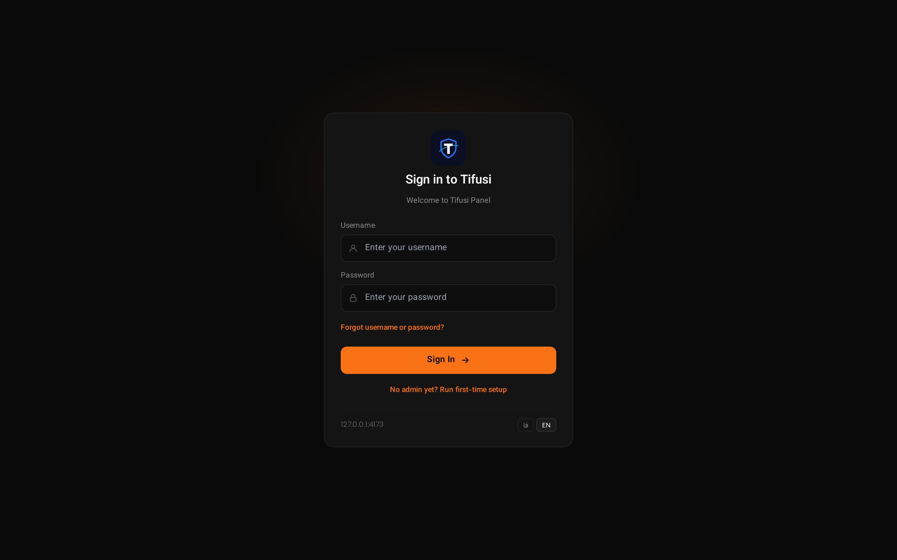
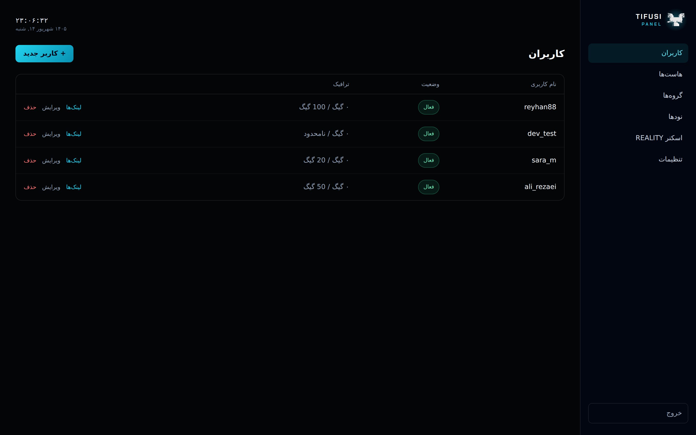
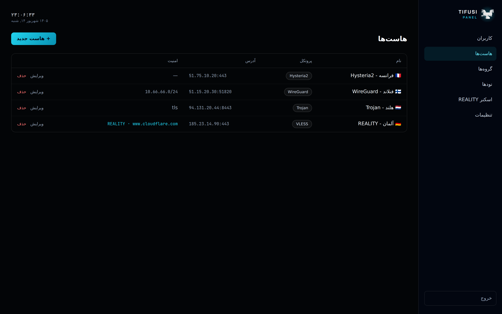
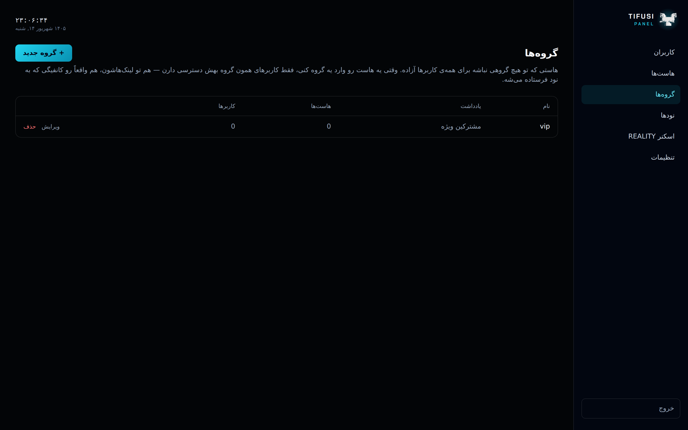
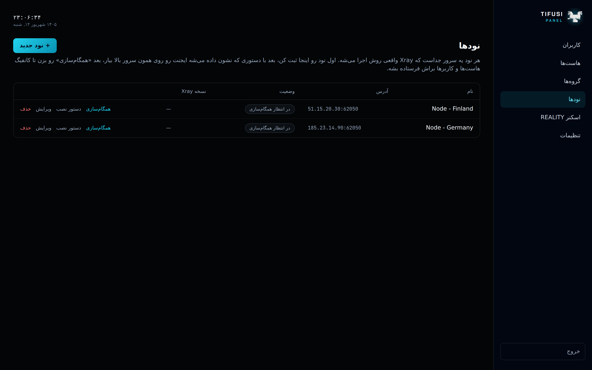
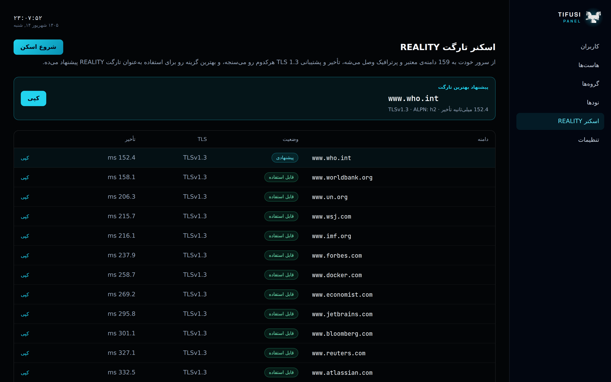
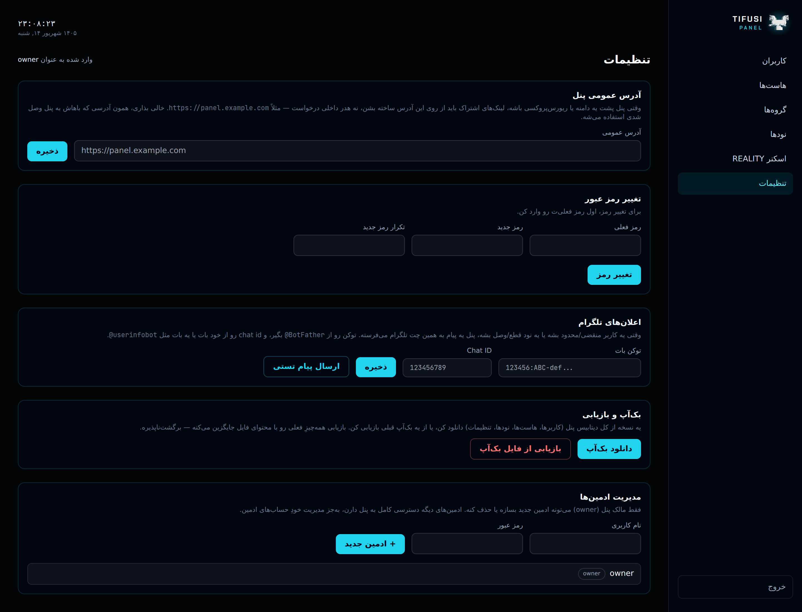
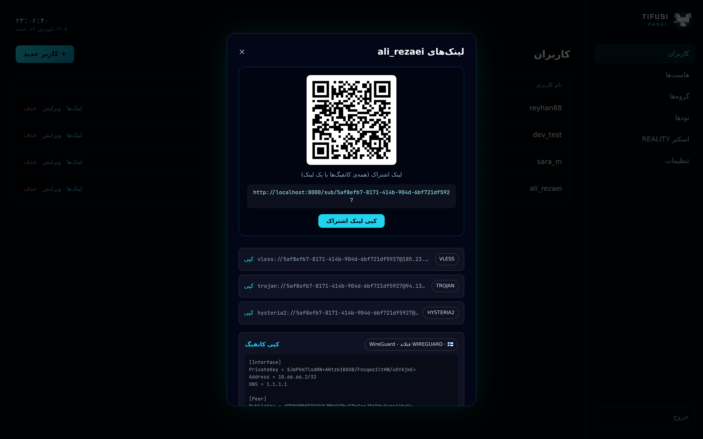

<p align="center">
  
</p>

<h1 align="center">TIFUSI PANEL</h1>

<p align="center"><b>کنترل یکپارچه و امن زیرساخت پروکسی</b></p>

<hr>

<p align="center">
  <a href="https://github.com/javadtifusi-eng/Tifusi-Panel/stargazers"></a>
  
</p>

<p align="center">
  🇬🇧 <a href="README.md">English</a> / 🇮🇷 <b>فارسی</b> / 🇷🇺 <a href="README.ru.md">Русский</a>
</p>

<hr>

پنل مدیریت پروکسی — رابط وب یکپارچه + REST API، ساخته‌شده با FastAPI و React. همون الگوی معماری PasarGuard (بک‌اند Python/FastAPI، داشبورد React، دیپلوی با Docker)، ولی با ظاهر و روند راه‌اندازی کاملاً اختصاصی. پروتکل‌های پشتیبانی‌شده: **VLESS، Trojan، WireGuard، Hysteria2** (بدون VMess یا Shadowsocks).

## اسکرین‌شات‌ها

















## چی اینجا ساخته شده

- **بک‌اند** (`backend/`): FastAPI + SQLAlchemy (async، پیش‌فرض SQLite)، احراز هویت JWT، مهاجرت‌های Alembic.
- **فرانت‌اند** (`frontend/`): React + Vite + Tailwind، جهت طراحی «Obsidian Glow»، صفحه‌ی ورود دوزبانه (فارسی/انگلیسی).
- **کاربران**: ساخت/لیست/فعال‌غیرفعال‌کردن/حذف کاربر پروکسی، با سقف حجم مصرفی و ردیابی مصرف واقعی، و انتقال خودکار به وضعیت `منقضی`/`محدود` وقتی کاربر از تاریخ انقضا یا سقف حجمش رد بشه.
- **هاست‌ها**: اندپوینت‌های VLESS/Trojan/WireGuard/Hysteria2. برای VLESS/Trojan شبکه‌ی انتقال (tcp/ws/grpc) و امنیت (none/tls/reality) رو انتخاب می‌کنی؛ هاست‌های WireGuard یه کلید سرور + یک ساب‌نت تونل می‌گیرن.
- **گروه‌ها**: کنترل دسترسی واقعی، نه فقط سازمان‌دهی — هاستی که تو هیچ گروهی نباشه سراسری‌ه (همه‌ی کاربرها می‌بیننش)، وقتی به یه گروه اضافه بشه فقط کاربرهای همون گروه می‌تونن ببیننش یا ازش استفاده کنن. همین قانون هم رو ساخت لینک‌ها و هم رو کانفیگ واقعیِ ارسالی به نودها اعمال می‌شه.
- **اسکنر REALITY**: حدود ۱۶۰ دامنه‌ی کاندید رو از نظر تأخیر تست می‌کنه و سریع‌ترینشون رو به‌عنوان تارگت REALITY پیشنهاد می‌ده، مستقیم از تو فرم هاست‌ها.
- **لینک‌های اشتراک**: هر کاربر یه لینک `vless://`/`trojan://`/`hysteria2://` به‌ازای هر هاست می‌گیره، یه فایل `.conf` وایرگارد برای هر هاست WireGuard (که کلید و IP اختصاصی‌ش تنبل ساخته می‌شه)، به‌علاوه یه لینک اشتراک (`/sub/<secret>`، بدون نیاز به احراز هویت ادمین — اپ‌های کلاینت مستقیم بهش وصل می‌شن) همراه با QR کد.
- **نودها**: یه سرور رو ثبت کن، یه دستور `docker run` برای اجرای node agent روش بگیر، بعد «همگام‌سازی» بزن تا کانفیگ Xray ساخته‌شده بهش پوش بشه و وضعیتش **متصل** بشه همراه با ورژن Xray. بعد از اون، سلامتش خودکار چک می‌شه، و مصرف واقعیِ هر کاربر از API آمار خودِ Xray روی یه بازه‌ی زمانی کشیده می‌شه. بخش [نودها و node agent](#نودها-و-node-agent) رو ببین برای این‌که این agent دقیقاً چیکار می‌کنه و محدودیت‌های فعلیش چیه.
- **تنظیمات**: آدرس عمومی پنل و رمز عبور ادمین رو در لحظه (بدون نیاز به ری‌دیپلوی) عوض کن، به‌علاوه بک‌آپ/بازیابی دیتابیس با یه کلیک — همه از داخل داشبورد.
- **Docker**: `docker-compose.yml` پنل + داشبورد رو اجرا می‌کنه. node agent (`backend/node_agent/`) جدا و برای هر نود یه بار اجرا می‌شه — پایین‌تر ببین.

هنوز ساخته نشده: محدودسازی دسترسی به تفکیک هر ادمین، مدیریت واقعیِ اینترفیس WireGuard رو نود (`wg-quick`) — لیست کامل و چند ایده‌ی بزرگ‌تر که در حال بررسیشونیم رو تو `ROADMAP.md` ببین.

## نصب سریع

**پنل** (سروری که داشبورد/API روش اجرا می‌شه):
```bash
bash -c "$(curl -fsSL https://raw.githubusercontent.com/javadtifusi-eng/Tifusi-Panel/main/install.sh)"
```
اگه داکر نصب نباشه خودکار نصبش می‌کنه (با اسکریپت رسمی `get.docker.com`)، ریپو رو کلون می‌کنه، اگه یه دامنه داشته باشی که به این سرور اشاره می‌کنه، اختیاری یه گواهی رایگان Let's Encrypt هم می‌گیره (پس پنل مستقیم HTTPS سرو می‌کنه، بدون نیاز به ریورس‌پروکسی)، و پنل رو با Docker Compose بالا میاره. ساخت حساب ادمین خودش بعداً از صفحه‌ی ورود تو مرورگر انجام می‌شه — روند کاملش پایین‌تر اومده.

**نود** (هر سروری که واقعاً قراره Xray-core روش اجرا بشه — اول از تب نودهای پنل، نود رو بساز تا API Key بگیری):
```bash
bash -c "$(curl -fsSL https://raw.githubusercontent.com/javadtifusi-eng/Tifusi-Panel/main/install-node.sh)" -- <API_KEY> [PORT]
```
فقط node agent رو می‌سازه و اجرا می‌کنه — نه کل پنل، نه دیتابیس، هیچ چیز اضافه‌ی دیگه‌ای رو اون سرور.

هر دو اسکریپت اول چک می‌کنن داکر نصب باشه و اگه نبود، خودشون با اسکریپت رسمی `get.docker.com` نصبش می‌کنن.

## روند اولین اجرا (دستی / بدون install.sh)

به‌جای این‌که بفرستنت سراغ مستندات برای پیدا کردن یه دستور CLI، صفحه‌ی ورود مستقیم نشونش می‌ده، با یه دکمه‌ی کپی:

1. استک رو بالا بیار: `docker compose up -d`
2. پنل رو باز کن — چون هنوز ادمینی نیست، کارت **راه‌اندازی اولیه** رو نشون می‌ده با یه دکمه که دستور دقیق رو کپی می‌کنه (با هاور روش، خودِ دستور رو می‌بینی).
3. دستور کپی‌شده رو تو ترمینال سرورت اجرا کن:
   ```bash
   docker exec -it tifusi-panel tifusi-cli generate-admin-key
   ```
4. کلید چاپ‌شده رو تو همون کارت پیست کن، یه نام‌کاربری/رمز عبور انتخاب کن، و حساب ادمین مالک ساخته می‌شه — بدون صفحه‌ی جدا، بدون نیاز به ترک مرورگر.

همون `install.sh` بالا مرحله‌ی ۱ رو برات انجام می‌ده؛ از اونجا به بعد مراحل ۲ تا ۴ رو تو مرورگر ادامه بده.

## نودها و node agent

یه Node یه سرویه که واقعاً Xray-core روش اجرا می‌شه. `backend/node_agent/` یه سرویس کوچیک FastAPI‌ه که قراره رو همون سرور اجرا بشه: پنل یه کانفیگ ساخته‌شده‌ی Xray رو با POST به اندپوینت `/config`ش می‌فرسته (با احراز هویت از طریق یه API key اختصاصیِ همون نود)، اونم `xray run -config ...` رو (دوباره) اجرا می‌کنه، و از طریق `/health` وضعیتش رو گزارش می‌ده.

```bash
docker build -t tifusi-node-agent -f backend/node_agent/Dockerfile backend
docker run -d --name tifusi-node --restart unless-stopped \
  -p 62050:62050 -e TIFUSI_NODE_API_KEY=<از دکمه‌ی "دستور نصب" تو پنل> \
  tifusi-node-agent
```

فایل Dockerfile این node agent، باینری واقعیِ Xray-core رو موقع build از ریلیزهای گیت‌هابش دانلود می‌کنه — این مرحله رو نمی‌شد تو محیط sandboxی که این پروژه توش ساخته شده تایید کرد (دسترسی خروجی به گیت‌هاب اونجا بلاک بود)، پس **قبل از اعتماد کردن بهش تو محیط عملیاتی، رو یه ماشین واقعی بسازش و اجراش کن**. بقیه‌چیزا (تولید کانفیگ، قرارداد HTTP بین پنل و agent، گزارش وضعیت) رو با یه باینری جایگزین از اول تا آخر همون‌جا تایید کردیم.

فقط هاست‌های VLESS و Trojan وارد خودِ کانفیگ Xray می‌شن — Hysteria2 اصلاً بخشی از Xray-core نیست (یه سرور جداست) و WireGuard یه قضیه‌ی سطح کرنل/`wg-quick`ه، که هیچ‌کدوم این‌جا استارت نمی‌شن. هر دوتاشون به‌جای این‌که یه inbound خراب بگیرن، رد می‌شن؛ WireGuard هنوز تو سطح ساخت لینک کاملاً پشتیبانی می‌شه (بالا رو ببین)، فقط نه توسط این node agent.

## توسعه‌ی لوکال

**بک‌اند**
```bash
cd backend
pip install -r requirements.txt
uvicorn app.main:app --reload
```

**فرانت‌اند**
```bash
cd frontend
npm install
npm run dev
```
سرور توسعه‌ی Vite مسیر `/api` رو به `http://localhost:8000` پروکسی می‌کنه.

**ساخت کلید راه‌اندازی بدون Docker**
```bash
cd backend
python -m cli.main generate-admin-key
```

## مهاجرت‌های دیتابیس

تغییرات schema از مسیر Alembic (`backend/alembic/`) رد می‌شه، نه `Base.metadata.create_all()` — برنامه رو هر بار اجرا، خودکار `alembic upgrade head` رو می‌زنه (`app/migrate.py`، از داخل `init_db()` صدا زده می‌شه)، پس یه دیپلوی معمولی همیشه به آخرین schema می‌رسه بدون قدم دستی و بدون نیاز به پاک کردن دیتابیس.

وقتی یه مدل عوض می‌شه، migration رو بساز و همراه با تغییر مدل کامیت کن:
```bash
cd backend
alembic revision --autogenerate -m "توضیح تغییر"
```
همیشه قبل از کامیت، فایل ساخته‌شده رو بخون — autogenerate یه پیش‌نویس خوبه، نه یه تضمین، مخصوصاً برای چیزایی که SQLite باهاشون دست‌وپنجه نرم می‌کنه (مثلاً تغییر یه ستون موجود ممکنه نیاز به `op.batch_alter_table(...)` داشته باشه).

## دیپلوی با Docker

```bash
cp .env.example .env   # یه TIFUSI_SECRET_KEY واقعی بذار، و TIFUSI_PUBLIC_URL اگه پشت پروکسی‌ای
docker compose up -d --build
```

- API پنل: `http://localhost:8000`
- داشبورد: `http://localhost:8080`
- دیتای SQLite تو `./data` ذخیره می‌مونه

وقتی پنل پشت Docker/یه پروکسی باشه، `TIFUSI_PUBLIC_URL` رو ست کن (مثلاً `https://your-domain.example`) — بدونش، لینک‌های اشتراک از روی هدر Host درخواست ساخته می‌شن، که اونجا یه هاست‌نیم داخلیِ کانتینره، نه چیزی که یه کلاینت بتونه بهش برسه. این متغیر محیطی فقط مقدار پیش‌فرض اولیه‌ست: یه ادمین می‌تونه هر وقت از همون صفحه‌ی تنظیمات پنل (همونجایی که رمز ادمین هم عوض می‌شه) ببینتش و عوضش کنه، بدون نیاز به ری‌دیپلوی.

### HTTPS رو داشبورد (توصیه‌شده، بدون نیاز به ریورس‌پروکسی جدا)

کانتینر `dashboard` (همونی که واقعاً تو مرورگر بازش می‌کنی) می‌تونه خودش TLS رو رو پورت ۴۴۳ تموم کنه و `/api/` و `/sub/` رو داخلی به پنل پروکسی کنه — این دقیقاً همون کاریه که مرحله‌ی دامنه/Let's Encrypt تو `install.sh` برات انجام می‌ده. برای انجام دستیش: فایل‌های `fullchain.pem`/`privkey.pem` رو تو `./certs` بذار، خط `./certs:/etc/nginx/certs:ro` رو زیر سرویس `dashboard` تو `docker-compose.yml` از کامنت دربیار، و ری‌استارت کن. کانتینر خودش موقع بالا اومدن گواهی رو تشخیص می‌ده (نیازی به دستکاری `nginx.conf` نیست) و پورت ۸۰ رو به ۴۴۳ ریدایرکت می‌کنه.

### TLS مستقیم رو پنل (پیشرفته، بدون داشبورد/ریورس‌پروکسی جلوش)

به‌صورت پیش‌فرض، کانتینر پنل داخلاً HTTP ساده اجرا می‌کنه — nginx داشبورد باید روی اینترنت باز باشه (بالا رو ببین). اگه اصلاً از کانتینر داشبورد استفاده نمی‌کنی و می‌خوای خودِ uvicorn برای دسترسی مستقیم به API، TLS رو تموم کنه:

```bash
# تو .env
TIFUSI_SSL_CERTFILE=/app/certs/fullchain.pem
TIFUSI_SSL_KEYFILE=/app/certs/privkey.pem
```

و گواهی‌هات رو تو کانتینر mount کن (خط `./certs:/app/certs:ro` رو تو `docker-compose.yml` از کامنت دربیار). نقطه‌ی ورود کانتینر (`run.py`) این‌ها رو خودکار می‌گیره — هیچ چیز دیگه‌ای عوض نمی‌شه. هر دو متغیر باید با هم ست بشن، یا هیچ‌کدوم؛ ست کردن فقط یکیشون، به‌جای برگشتن خاموش به HTTP، همون اول اجرا با خطا متوقف می‌شه.

## مرجع‌های طراحی

- سه جهت بصری قبل از قرار گرفتن رو «Obsidian Glow» (همینی که پیاده‌سازی شده) بررسی شدن — بقیه‌ی گزینه‌ها رو تو تاریخچه‌ی پروژه (design canvas) ببین.
- نشان گریفین، مارک اختصاصی خودِ Tifusi‌ه، از `assets/logo-tifusi.svg` پروژه‌ی `Tifusi-Tunnel` استفاده مجدد شده.
