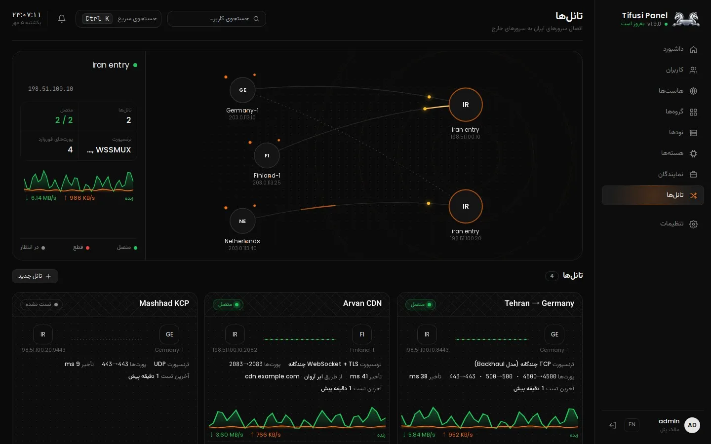

  

<h1 align="center">TIFUSI PANEL</h1>

<b>سامانه‌ی خودمیزبان مدیریت زیرساخت پروکسی و VPN</b>

  
  
  
  
  

  
   
  <a href="https://javadtifusi-eng.github.io/Tifusi-Panel/fa/"><b>📖 مستندات کامل در سایت</b></a>

 <a href="README.md">English</a> &nbsp;·&nbsp;  <b>فارسی</b> &nbsp;·&nbsp;  <a href="README.ru.md">Русский</a>

  
    
  

  

