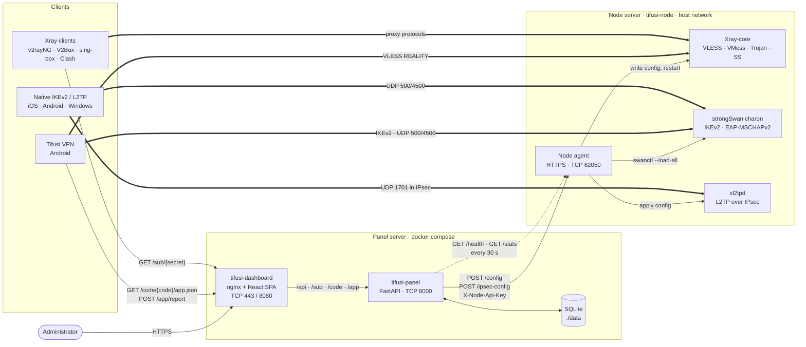
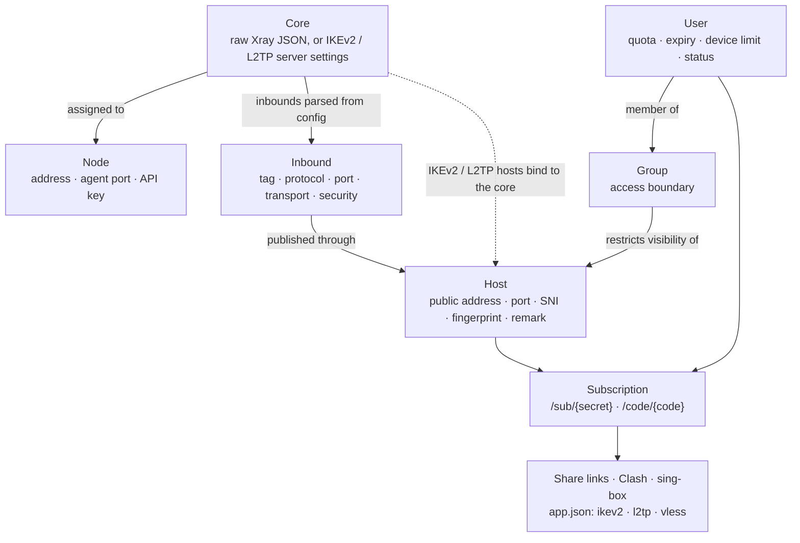
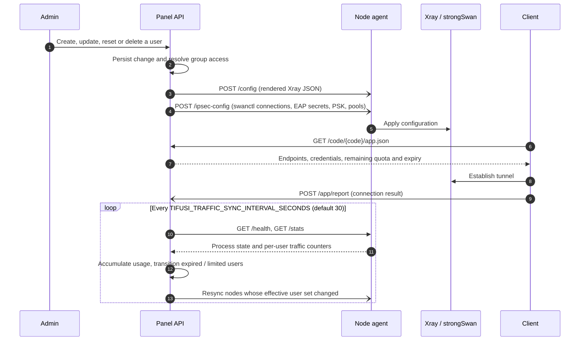

<p align="center">
  
</p>

<h1 align="center">TIFUSI PANEL</h1>

<hr>

<p align="center">
  <a href="https://github.com/javadtifusi-eng/Tifusi-Panel/stargazers"></a>
  
  <a href="https://t.me/javadheydeari"></a>
  
  <a href="LICENSE"></a>
</p>

<p align="center">
  
  
  
  
  
  
  
</p>

<p align="center">
   <b>English</b> &nbsp;·&nbsp;  <a href="README.fa.md">فارسی</a> &nbsp;·&nbsp;  <a href="README.ru.md">Русский</a>
</p>

<hr>

Tifusi Panel is a self-hosted control plane for proxy and VPN infrastructure. A single panel instance stores users, access policy and core configurations, renders per-node configuration, and pushes it to any number of remote nodes over an authenticated HTTPS API. Nodes run Xray-core for VLESS, VMess, Trojan and Shadowsocks, and strongSwan with xl2tpd for IKEv2/IPsec and L2TP/IPsec. Subscription endpoints serve share links, Clash and sing-box profiles, and a structured JSON profile consumed by the Tifusi VPN client. WireGuard is not supported.

<p align="center">
  
  <br /><br />
  
</p>

## What's new in v1.2

- **Redesigned dashboard.** A new sign-in and setup screen, a live overview with a "needs attention" list and period-over-period traffic, and redesigned users, hosts, groups, nodes, cores, tunnels and settings pages.
- **Access at a glance.** An interactive access map and a clickable matrix on the groups page; a traffic-flow view of every Xray core.
- **Faster loading.** One JS and one CSS bundle, precompressed and served with `gzip_static`.
- **Version status.** The header shows the running version and whether it is up to date.

Full notes: [CHANGELOG.md](CHANGELOG.md).

## Architecture

### Components and data flow



Solid arrows are control-plane requests, dotted arrows are periodic polling, and thick arrows are data-plane traffic. The panel never proxies user traffic; clients connect directly to the node addresses published by hosts.

### Configuration model



A host without a group is visible to all users. Once a host is attached to one or more groups, it is included in subscriptions and node configurations only for members of those groups.

### Node synchronisation lifecycle



### Transport security between panel and node

- The agent serves HTTPS with a self-signed certificate generated on first start (`backend/node_agent/tls.py`). This encrypts credentials and pushed secrets in transit.
- Every request carries the per-node key in the `X-Node-Api-Key` header. The panel does not verify the agent certificate, so the API key is the effective credential; mutual TLS is not yet implemented.
- The node container uses `--network host` so that Xray can bind ports defined after the container starts, and so that UDP 500, 4500 and 1701 reach charon and xl2tpd on the public address.

## Features

- **Users.** Individual and bulk creation, enable/disable and deletion. Data quotas with usage accounting, automatic `expired` and `limited` transitions, on-hold accounts whose validity period starts at first connection, per-user device limits and reusable templates.
- **Cores.** Either a complete Xray JSON configuration, with structured editors for routing, outbounds and DNS, or the server parameters of an IKEv2/L2TP deployment. Each core is assigned to one or more nodes.
- **Hosts.** Public endpoints for VLESS, VMess, Trojan, Shadowsocks, Hysteria2, L2TP and IKEv2. Xray-based hosts reference an inbound parsed from the core configuration, from which transport, security and REALITY parameters are inherited. L2TP hosts use a shared PSK. IKEv2 hosts authenticate the server with an X.509 certificate (self-signed by default, or an imported CA-issued chain) and each user with EAP-MSCHAPv2.
- **Groups.** Enforced access control. Group membership determines both the links a user receives and the credentials rendered into node configurations.
- **REALITY target scanner.** Measures latency to approximately 160 candidate SNI domains and proposes the fastest one from the host form.
- **Subscriptions.** Per-host `vless://`, `vmess://`, `trojan://`, `ss://` and `hysteria2://` URIs; connection parameters for L2TP and IKEv2; an IKEv2 `.mobileconfig` profile; a single subscription URL with QR code. Clash-family and sing-box clients are detected by User-Agent and receive a native profile.
- **Resellers.** The owner creates reseller accounts on the Resellers page, each with its own sign-in, the protocols it may hand out and an optional limit on users, on total volume, or both. A reseller only sees and manages its own users, picks one of its allowed protocols per user, sees its remaining allowance on the Users page, and has no access to nodes, hosts, cores, tunnels, groups or settings.
- **Tifusi VPN profile.** `GET /sub/{secret}/app.json` and `GET /code/{code}/app.json` return IKEv2, L2TP and VLESS endpoints together with quota and expiry data. Client connection results posted to `/app/report` are listed per user and in the dashboard activity feed.
- **Nodes.** Registration generates a one-line install command bound to the node key. After the first successful sync, health and traffic collection run continuously.
- **Tunnels.** Publishes a foreign server through a relay inside a restricted network, so the foreign server requires no open inbound port. The panel generates install commands for both sides and proposes a transport based on a live latency measurement.
- **Administration.** An owner account plus additional administrators with scoped permissions. Scoped administrators see only the users they created. Each administrator can issue API keys for automation.
- **Notifications.** Telegram, Discord and generic webhooks for user and node state transitions.
- **Settings.** Public URL, administrator password, TLS certificate upload or Let's Encrypt issuance, and database backup and restore, all applied without redeployment.
- **Interface.** React 18, Vite and Tailwind CSS; Persian (RTL) and English localisation; self-hosted Vazirmatn and Poppins typefaces.

Planned and deliberately excluded work is tracked in [`ROADMAP.md`](ROADMAP.md).

## Repository layout

| Path | Contents |
| --- | --- |
| `backend/app` | FastAPI application: routers, SQLAlchemy models, Xray config builder, subscription renderers, node sync, traffic accounting |
| `backend/alembic` | Database migrations |
| `backend/cli` | `tifusi-cli`, including first-run admin key generation |
| `backend/node_agent` | Node agent service, strongSwan/xl2tpd integration, node Dockerfile |
| `backend/tunnel_agent` | Relay agent for the Tunnels feature (Go) |
| `frontend` | React dashboard and nginx image |
| `install.sh`, `install-node.sh` | Panel and node installers |
| `manage.sh` | Operations menu, installed as `/usr/local/bin/tifusi-panel` and run as `tifusi panel` |
| `scripts/tifusi` | Shared `tifusi` launcher for Tifusi Panel, Tifusi Bot and the Tifusi VPN app |
| `.github/workflows/build-images.yml` | Builds and publishes panel, dashboard and node images to GHCR |

## Requirements

### Server sizing

| Role | Minimum | Recommended |
| --- | --- | --- |
| Panel | 1 vCPU, 1 GB RAM, 10 GB disk | 2 vCPU, 2 GB RAM, 20 GB disk |
| Node | 1 vCPU, 512 MB RAM, 10 GB disk | 1 vCPU, 1 GB RAM, 20 GB disk |
| Panel and node on one server | 1 vCPU, 2 GB RAM, 15 GB disk | 2 vCPU, 2 GB RAM, 25 GB disk |
| Panel, professional edition (MySQL) | 2 vCPU, 2 GB RAM, 20 GB disk | 2 vCPU, 4 GB RAM, 40 GB disk |

Measured on a running installation: the panel container uses about 100 MB of RAM, the dashboard about 6 MB and a node about 50 MB; the images take about 1 GB of disk. The larger recommended disk leaves room for image updates, logs and backups. Traffic volume, not user count, is what drives node CPU and bandwidth needs.

### Platform

- OS: Ubuntu 22.04/24.04 or Debian 11/12 (the installers use `apt-get`). Other Linux distributions work with Docker installed manually.
- Architecture: x86_64 (amd64). Prebuilt images are published for amd64 only; other architectures build locally, which takes considerably longer.
- Root access and a public IPv4 address.

### Network

- Panel: a DNS record pointing to the server is recommended for TLS. Port 80 must be reachable to issue a free Let's Encrypt certificate.
- Node: IKEv2 requires UDP 500 and 4500; L2TP additionally requires UDP 1701 and the `l2tp_ppp` and `ppp_generic` kernel modules on the host.
- Building images locally requires outbound access to GitHub releases for Xray-core and to the strongSwan source archive.

## Installation

> **Minimum server for the panel:** 1 CPU core, 1 GB RAM, 10 GB disk.
> **For comfortable installation and management:** 2 CPU cores, 2 GB RAM, 20 GB disk, Ubuntu 22.04/24.04 or Debian 11/12 on x86_64.
> Running the panel and a node on the same server: at least 2 GB RAM and 25 GB disk. Details in [Requirements](#requirements).
> **Professional edition (MySQL):** 2 CPU cores, at least 2 GB RAM (4 GB recommended), 20 GB disk.

### Panel — standard edition (SQLite)

```bash
bash -c "$(curl -fsSL https://raw.githubusercontent.com/javadtifusi-eng/Tifusi-Panel/main/install.sh)"
```

The installer provisions Docker, clones the repository, generates `TIFUSI_SECRET_KEY`, optionally issues a Let's Encrypt certificate for a domain that resolves to the server, and starts the stack with Docker Compose. It also installs the `tifusi panel` management command.

### Panel — professional edition (MySQL)

```bash
bash -c "$(curl -fsSL https://raw.githubusercontent.com/javadtifusi-eng/Tifusi-Panel/main/install.sh)" -- --pro
```

The same panel with every record (users, nodes, hosts, groups, cores and settings) stored in a bundled MySQL 8.4 container instead of the built-in SQLite file. The installer generates the MySQL passwords, keeps MySQL reachable only on the internal Docker network and stores its data in `mysql-data/`. Choose it for large user bases or when you want a standard database server to manage and back up; `tifusi panel backup` and `tifusi panel restore` include a MySQL dump. Nodes are installed the same way for both editions.

### Node

Create the node on the **Nodes** page to obtain its API key, then run on the node server:

```bash
bash -c "$(curl -fsSL https://raw.githubusercontent.com/javadtifusi-eng/Tifusi-Panel/main/install-node.sh)" -- <API_KEY> [PORT]
```

`PORT` defaults to `62050`. The script pulls the prebuilt node image (or builds it locally if unavailable), loads the required kernel modules and starts the `tifusi-node` container on the host network. Select **Sync** in the panel to push the initial configuration.

### First-run setup

1. Open the dashboard. When no administrator exists, the sign-in screen offers the setup procedure.
2. Generate a one-time setup key on the panel server:
   ```bash
   docker exec -it tifusi-panel tifusi-cli generate-admin-key
   ```
3. Enter the key, then choose the owner username and password.

## Operations

`tifusi panel` runs an interactive menu, or a single action when given an argument:

| Command | Action |
| --- | --- |
| `tifusi panel update` | Update to the latest release and recreate the containers |
| `tifusi panel status` | Show container state |
| `tifusi panel logs` | Follow container logs |
| `tifusi panel restart` | Restart the stack |
| `tifusi panel port` | Change the panel API and dashboard ports |
| `tifusi panel ssl` | Issue a Let's Encrypt certificate |
| `tifusi panel key` | Generate a new administrator setup key |
| `tifusi panel backup` / `tifusi panel restore` | Export or restore the database |
| `tifusi panel uninstall` | Remove the installation |

`tifusi` is a launcher shared with [Tifusi Bot](https://github.com/javadtifusi-eng/Tifusi-Bot): `tifusi bot` opens the bot installer menu and `tifusi app` prints the latest Tifusi VPN Android release with its download link. When only one of the panel and the bot is installed on a server, `tifusi` without a subcommand opens that component, so `tifusi update` continues to work.

## Deployment reference

### Docker Compose

```bash
cp .env.example .env    # set TIFUSI_SECRET_KEY; set TIFUSI_PUBLIC_URL when behind a reverse proxy
docker compose up -d --build
```

| Service | Container | Ports |
| --- | --- | --- |
| Panel API | `tifusi-panel` | `8000` (API), `80` (ACME HTTP-01 challenge only) |
| Dashboard | `tifusi-dashboard` | `8080` (HTTP), `443` (HTTPS) |

SQLite data is stored in `./data`. `TIFUSI_PUBLIC_URL` defines the base URL used in subscription links; without it, links are derived from the request `Host` header, which is not reachable from clients when the panel runs behind a proxy. The value can later be changed from **Settings** at runtime.

### TLS on the dashboard

The dashboard container terminates TLS on port 443 and proxies `/api/`, `/sub/`, `/code/` and `/app/` to the panel. It reads `fullchain.pem` and `privkey.pem` from `./certs`, which is watched continuously; certificate changes take effect without a restart. Certificates can be supplied by the installer, uploaded under **Settings → SSL Certificate**, or placed in `./certs` manually.

### Direct TLS on the API

For deployments without the dashboard container, uvicorn can terminate TLS directly:

```bash
TIFUSI_SSL_CERTFILE=/app/certs/fullchain.pem
TIFUSI_SSL_KEYFILE=/app/certs/privkey.pem
```

Mount `./certs:/app/certs:ro` in `docker-compose.yml`. Both variables must be set together; setting only one aborts startup rather than falling back to plain HTTP.

### Database migrations

The schema is managed with Alembic, and `alembic upgrade head` runs on every startup. When a model changes, generate and review a migration:

```bash
cd backend
alembic revision --autogenerate -m "describe the change"
```

SQLite requires `op.batch_alter_table(...)` for column alterations that cannot be applied in place; review autogenerated revisions before committing.

## Development

**Backend**
```bash
cd backend
pip install -r requirements.txt
uvicorn app.main:app --reload
```

**Frontend**
```bash
cd frontend
npm install
npm run dev
```

The Vite development server proxies `/api` to `http://localhost:8000`. A setup key can be generated without Docker with `python -m cli.main generate-admin-key` from `backend/`.

**Node agent image**
```bash
docker build -t tifusi-node-agent -f backend/node_agent/Dockerfile backend
```

## Related projects

- [Tifusi VPN](https://github.com/javadtifusi-eng/Tifusi-VPN): Android client for IKEv2 and VLESS REALITY, provisioned from this panel by subscription link, access code or QR code.
- [Tifusi Bot](https://github.com/javadtifusi-eng/Tifusi-Bot): Telegram storefront that provisions users through the panel API.

## License

Tifusi Panel is **source-available, not open source**. You may read the code, install the unmodified panel and run it for your own servers and services. Copying any part of the code, modifying and republishing it, rebranding it or selling it requires written permission. See [LICENSE](LICENSE).

## Credits

The emblem is carried over from the Tifusi-Tunnel project.
