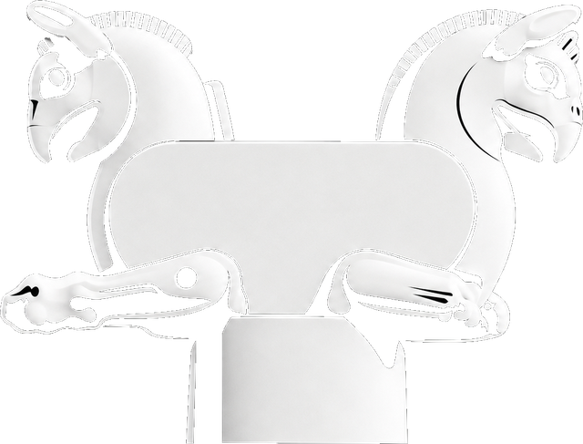
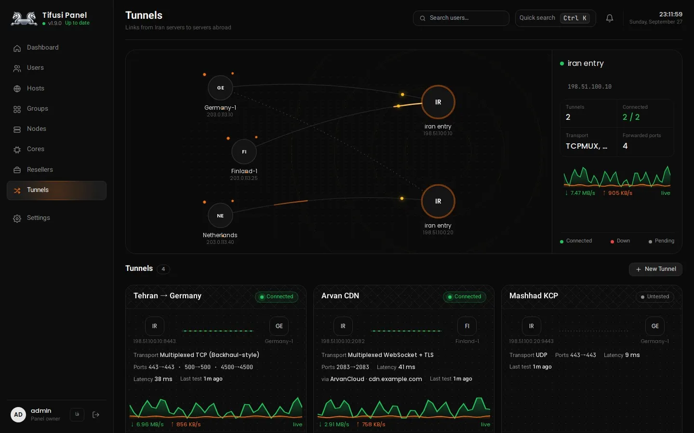

  

<h1 align="center">TIFUSI PANEL</h1>

<b>Self-hosted control plane for proxy and VPN infrastructure</b>

  
  
  
  
  

  
   
  <a href="https://javadtifusi-eng.github.io/Tifusi-Panel/en/"><b>📖 Full documentation on the website</b></a>

 <b>English</b> &nbsp;·&nbsp;  <a href="README.fa.md">فارسی</a> &nbsp;·&nbsp;  <a href="README.ru.md">Русский</a>

  
    
  

## Highlights

| | |
| --- | --- |
| 🌐 **Every protocol on one node** | Xray (VLESS, VMess, Trojan, Shadowsocks, REALITY), IKEv2, L2TP, PPTP, Hysteria2 and WireGuard side by side; the panel renders and pushes each node's config |
| 🚇 **Tunnels for hard networks** | Iran ↔ abroad relays over TCP/TLS/WebSocket/mux, a stealth transport, UDP (KCP), IP-spoofed carriers and CDN fronting, with a link test and live throughput |
| 🔑 **Install from the panel** | Nodes and both tunnel sides installed over SSH with the panel's own key — online, or from an offline bundle over SFTP for servers with no outside internet |
| 🛡️ **Updates that roll themselves back** | Config pushes validated (`xray -test`) with the last good config kept; tunnel binaries and node agents updated with automatic rollback, nodes one at a time with a canary |
| 🔒 **Guard rails** | Reserved ports (agent, SSH, internal APIs) can't be taken by an inbound; a refused config is shown on the node while it keeps serving |
| 👤 **Users & subscriptions** | One link for every client (plain, Clash, sing-box, HTML page), dynamic remark variables, groups per inbound or per host, on-hold, device limits, periodic resets, resellers with quotas |
| 📶 **Staying reachable** | Connection Shield failover, network health from inside Iran, backup subscription domains, REALITY target scanner |
| 🧪 **Tested** | A pytest suite (links, subscriptions, traffic, migrations, rollback paths) runs on every push; images are only published when it passes |

  

