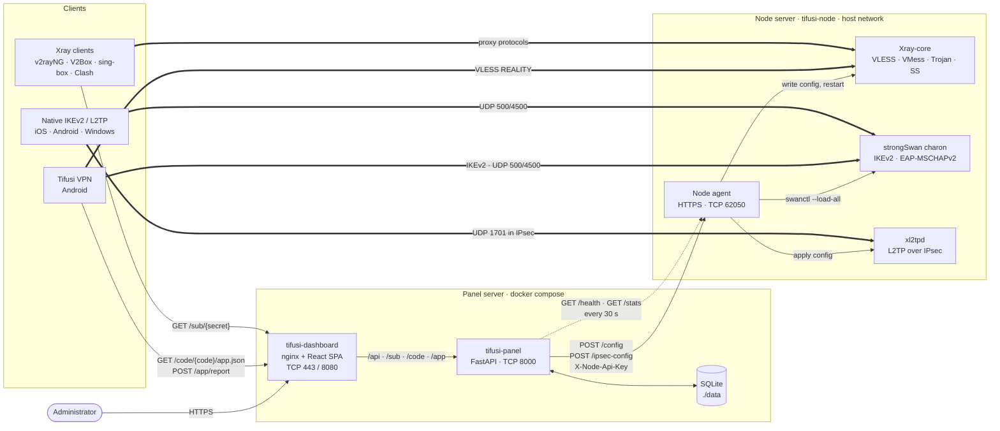
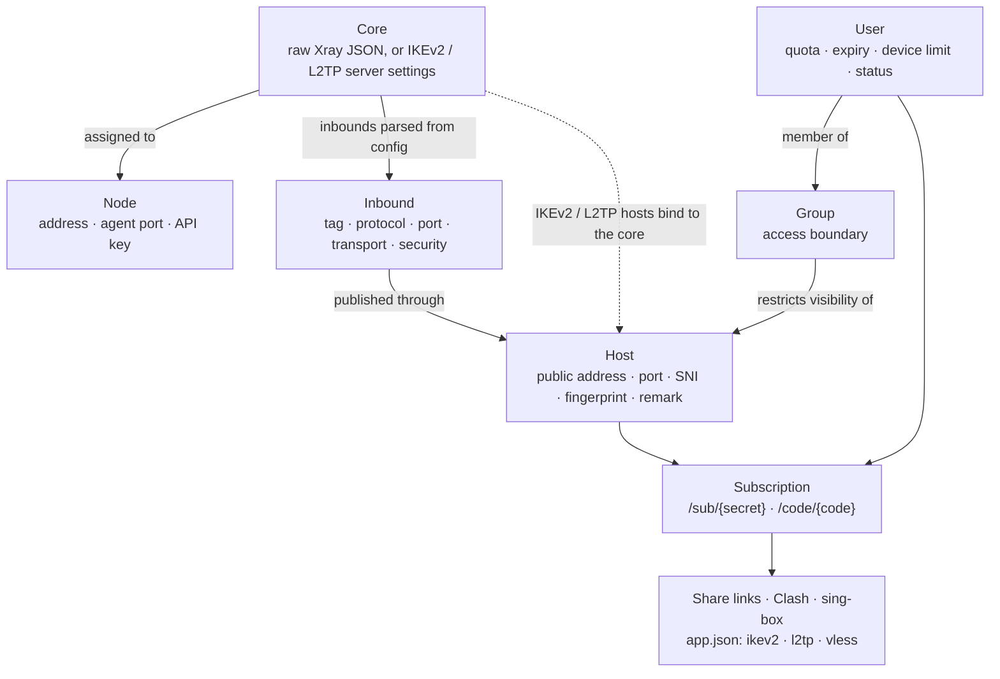
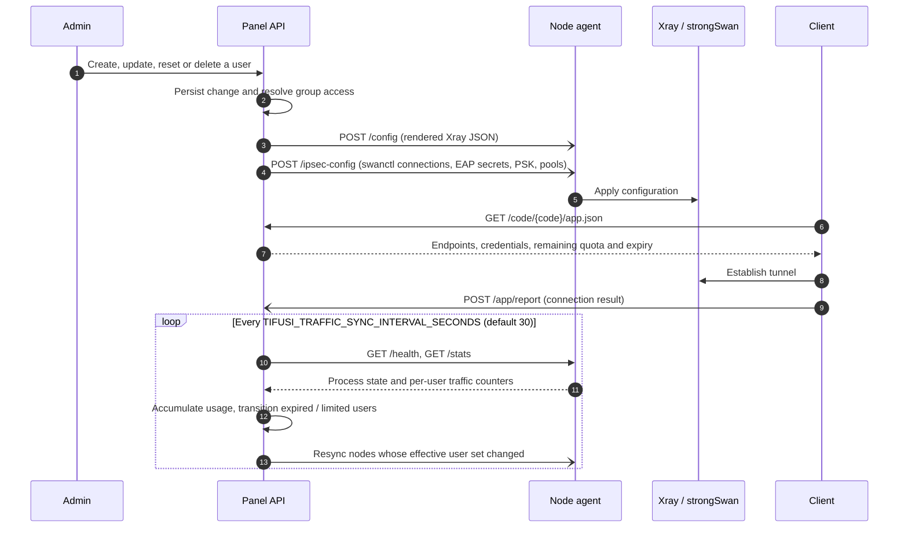

<p align="center">
  
</p>

<h1 align="center">TIFUSI PANEL</h1>

<hr>

<p align="center">
  <a href="https://github.com/javadtifusi-eng/Tifusi-Panel/stargazers"></a>
  
  
</p>

<p align="center">
  
  
  
  
  
  
  
</p>

<p align="center">
  🇬🇧 <a href="README.md">English</a> / 🇮🇷 <a href="README.fa.md">فارسی</a> / 🇷🇺 <b>Русский</b>
</p>

<hr>

Tifusi Panel — самостоятельно размещаемая плоскость управления для прокси- и VPN-инфраструктуры. Один экземпляр панели хранит пользователей, политику доступа и конфигурации ядер, формирует конфигурацию для каждого узла и передаёт её на произвольное число удалённых узлов через аутентифицированный HTTPS API. На узлах работают Xray-core для VLESS, VMess, Trojan и Shadowsocks, а также strongSwan с xl2tpd для IKEv2/IPsec и L2TP/IPsec. Эндпоинты подписки отдают ссылки, профили Clash и sing-box и структурированный JSON-профиль для клиента Tifusi VPN. WireGuard не поддерживается.

<p align="center">
  
  <br /><br />
  
</p>

## Что нового в v1.2

- **Новый дизайн панели.** Новый экран входа и первичной настройки, живой обзор со списком «требует внимания» и сравнением трафика с прошлым периодом, обновлённые страницы пользователей, хостов, групп, узлов, ядер, туннелей и настроек.
- **Доступы наглядно.** Интерактивная карта доступа и кликабельная матрица на странице групп; схема прохождения трафика для каждого ядра Xray.
- **Быстрая загрузка.** Один JS- и один CSS-файл, заранее сжатые и отдаваемые через `gzip_static`.
- **Статус версии.** В шапке показывается текущая версия и актуальна ли она.

Полный список изменений: [CHANGELOG.md](CHANGELOG.md).

## Архитектура

### Компоненты и потоки данных



Сплошные стрелки — запросы плоскости управления, пунктирные — периодический опрос, толстые — трафик плоскости данных. Панель не проксирует пользовательский трафик: клиенты подключаются напрямую к адресам узлов, опубликованным в хостах.

### Модель конфигурации



Хост без группы доступен всем пользователям. После привязки хоста к одной или нескольким группам он включается в подписки и конфигурации узлов только для участников этих групп.

### Жизненный цикл синхронизации узла



### Безопасность канала между панелью и узлом

- Агент обслуживает HTTPS с самоподписанным сертификатом, который создаётся при первом запуске (`backend/node_agent/tls.py`). Учётные данные и передаваемые секреты шифруются в пути.
- Каждый запрос содержит ключ узла в заголовке `X-Node-Api-Key`. Панель не проверяет сертификат агента, поэтому фактическим учётным данным является API-ключ; взаимный TLS пока не реализован.
- Контейнер узла запускается с `--network host`, чтобы Xray мог занимать порты, заданные после запуска контейнера, а UDP 500, 4500 и 1701 на публичном адресе доходили до charon и xl2tpd.

## Возможности

- **Пользователи.** Создание, включение, отключение и удаление по одному и пакетно. Квоты трафика с учётом потребления, автоматические переходы в `expired` и `limited`, отложенные аккаунты со сроком действия от первого подключения, ограничение числа устройств и шаблоны.
- **Ядра (Cores).** Полная JSON-конфигурация Xray со структурированными редакторами routing, outbounds и DNS либо параметры сервера IKEv2/L2TP. Каждое ядро назначается одному или нескольким узлам.
- **Хосты.** Публичные точки подключения для VLESS, VMess, Trojan, Shadowsocks, Hysteria2, L2TP и IKEv2. Хосты на базе Xray ссылаются на inbound из конфигурации ядра и наследуют параметры transport, security и REALITY. Хосты L2TP используют общий PSK. Хосты IKEv2 аутентифицируют сервер сертификатом X.509 (по умолчанию самоподписанным или импортированной цепочкой от CA), а пользователей — через EAP-MSCHAPv2.
- **Группы.** Принудительный контроль доступа. Членство в группе определяет как ссылки пользователя, так и учётные данные в конфигурациях узлов.
- **Сканер целей REALITY.** Измеряет задержку до примерно 160 SNI-доменов и предлагает самый быстрый прямо в форме хоста.
- **Подписки.** URI `vless://`, `vmess://`, `trojan://`, `ss://` и `hysteria2://` для каждого хоста; параметры подключения L2TP и IKEv2; профиль `.mobileconfig` для IKEv2; единый URL подписки с QR-кодом. Клиенты семейства Clash и sing-box определяются по User-Agent и получают нативный профиль.
- **Профиль Tifusi VPN.** `GET /sub/{secret}/app.json` и `GET /code/{code}/app.json` возвращают точки подключения IKEv2, L2TP и VLESS вместе с квотой и сроком действия. Результаты подключений, отправленные клиентом на `/app/report`, отображаются у пользователя и в ленте активности дашборда.
- **Узлы.** При регистрации создаётся однострочная команда установки, привязанная к ключу узла. После первой успешной синхронизации проверка состояния и сбор трафика выполняются непрерывно.
- **Туннели.** Публикация зарубежного сервера через ретранслятор внутри ограниченной сети, без открытых входящих портов на зарубежном сервере. Панель генерирует команды установки для обеих сторон и предлагает транспорт по результатам измерения задержки.
- **Администрирование.** Учётная запись владельца и дополнительные администраторы с ограниченными правами. Ограниченные администраторы видят только созданных ими пользователей. Каждый администратор может выпускать API-ключи для автоматизации.
- **Уведомления.** Telegram, Discord и произвольные webhook для изменений состояния пользователей и узлов.
- **Настройки.** Публичный URL, пароль администратора, загрузка TLS-сертификата или выпуск Let's Encrypt, резервное копирование и восстановление базы данных без повторного развёртывания.
- **Интерфейс.** React 18, Vite и Tailwind CSS; локализация на персидский (RTL) и английский; локально размещённые шрифты Vazirmatn и Poppins.

Запланированные и сознательно исключённые задачи описаны в [`ROADMAP.md`](ROADMAP.md).

## Структура репозитория

| Путь | Содержимое |
| --- | --- |
| `backend/app` | Приложение FastAPI: роутеры, модели SQLAlchemy, генератор конфигурации Xray, рендеры подписок, синхронизация узлов, учёт трафика |
| `backend/alembic` | Миграции базы данных |
| `backend/cli` | `tifusi-cli`, включая генерацию ключа первичной настройки |
| `backend/node_agent` | Агент узла, интеграция strongSwan/xl2tpd, Dockerfile узла |
| `backend/tunnel_agent` | Агент ретранслятора для туннелей (Go) |
| `frontend` | React-дашборд и образ nginx |
| `install.sh`, `install-node.sh` | Установщики панели и узла |
| `manage.sh` | Меню эксплуатации, устанавливается как `/usr/local/bin/tifusi-panel` и запускается командой `tifusi panel` |
| `scripts/tifusi` | Общий лаунчер `tifusi` для Tifusi Panel, Tifusi Bot и приложения Tifusi VPN |
| `.github/workflows/build-images.yml` | Сборка и публикация образов панели, дашборда и узла в GHCR |

## Требования

### Требования к серверу

| Роль | Минимум | Рекомендуется |
| --- | --- | --- |
| Панель | 1 vCPU, 1 ГБ RAM, 10 ГБ диска | 2 vCPU, 2 ГБ RAM, 20 ГБ диска |
| Узел | 1 vCPU, 512 МБ RAM, 10 ГБ диска | 1 vCPU, 1 ГБ RAM, 20 ГБ диска |
| Панель и узел на одном сервере | 1 vCPU, 2 ГБ RAM, 15 ГБ диска | 2 vCPU, 2 ГБ RAM, 25 ГБ диска |

Замеры на работающей установке: контейнер панели использует около 100 МБ RAM, дашборд около 6 МБ, узел около 50 МБ; образы занимают около 1 ГБ диска. Запас диска нужен для обновлений образов, логов и резервных копий. Нагрузку на CPU и канал узла определяет объём трафика, а не число пользователей.

### Платформа

- ОС: Ubuntu 22.04/24.04 или Debian 11/12 (установщики используют `apt-get`). Другие дистрибутивы Linux работают при ручной установке Docker.
- Архитектура: x86_64 (amd64). Готовые образы публикуются только для amd64; на других архитектурах образы собираются локально, что заметно дольше.
- Доступ root и публичный IPv4-адрес.

### Сеть

- Панель: для TLS рекомендуется DNS-запись, указывающая на сервер. Для выпуска бесплатного сертификата Let's Encrypt должен быть доступен порт 80.
- Узел: для IKEv2 требуются UDP 500 и 4500; для L2TP дополнительно UDP 1701 и модули ядра `l2tp_ppp` и `ppp_generic` на хосте.
- Локальная сборка образов требует исходящего доступа к релизам Xray-core на GitHub и к архиву исходников strongSwan.

## Установка

### Панель

```bash
bash -c "$(curl -fsSL https://raw.githubusercontent.com/javadtifusi-eng/Tifusi-Panel/main/install.sh)"
```

Установщик подготавливает Docker, клонирует репозиторий, генерирует `TIFUSI_SECRET_KEY`, при необходимости выпускает сертификат Let's Encrypt для домена, указывающего на сервер, и запускает стек через Docker Compose. Также устанавливается команда управления `tifusi panel`.

### Узел

Создайте узел на странице **Nodes**, чтобы получить его API-ключ, затем выполните на сервере узла:

```bash
bash -c "$(curl -fsSL https://raw.githubusercontent.com/javadtifusi-eng/Tifusi-Panel/main/install-node.sh)" -- <API_KEY> [PORT]
```

`PORT` по умолчанию равен `62050`. Скрипт загружает готовый образ узла (или собирает его локально), подгружает необходимые модули ядра и запускает контейнер `tifusi-node` в сети хоста. Для отправки начальной конфигурации нажмите **Sync** в панели.

### Первичная настройка

<p align="center">
  
</p>

1. Откройте дашборд. Если администратор ещё не создан, экран входа предлагает процедуру настройки.
2. Сгенерируйте одноразовый ключ настройки на сервере панели:
   ```bash
   docker exec -it tifusi-panel tifusi-cli generate-admin-key
   ```
3. Введите ключ и задайте имя пользователя и пароль владельца.

## Эксплуатация

`tifusi panel` без аргументов открывает интерактивное меню, с аргументом выполняет одно действие:

| Команда | Действие |
| --- | --- |
| `tifusi panel update` | Обновить до последней версии и пересоздать контейнеры |
| `tifusi panel status` | Показать состояние контейнеров |
| `tifusi panel logs` | Просмотр журналов контейнеров |
| `tifusi panel restart` | Перезапустить стек |
| `tifusi panel port` | Изменить порты API панели и дашборда |
| `tifusi panel ssl` | Выпустить сертификат Let's Encrypt |
| `tifusi panel key` | Сгенерировать новый ключ настройки администратора |
| `tifusi panel backup` / `tifusi panel restore` | Экспорт или восстановление базы данных |
| `tifusi panel uninstall` | Удалить установку |

`tifusi` — общий лаунчер с [Tifusi Bot](https://github.com/javadtifusi-eng/Tifusi-Bot): `tifusi bot` открывает меню установщика бота, а `tifusi app` выводит последнюю версию Android-приложения Tifusi VPN и ссылку на загрузку. Если на сервере установлен только один из компонентов (панель или бот), `tifusi` без подкоманды открывает его, поэтому `tifusi update` продолжает работать.

## Справочник по развёртыванию

### Docker Compose

```bash
cp .env.example .env    # задайте TIFUSI_SECRET_KEY; TIFUSI_PUBLIC_URL — при работе за обратным прокси
docker compose up -d --build
```

| Сервис | Контейнер | Порты |
| --- | --- | --- |
| Panel API | `tifusi-panel` | `8000` (API), `80` (только ACME HTTP-01) |
| Dashboard | `tifusi-dashboard` | `8080` (HTTP), `443` (HTTPS) |

Данные SQLite хранятся в `./data`. `TIFUSI_PUBLIC_URL` задаёт базовый URL ссылок подписки; без него ссылки строятся из заголовка `Host` запроса, который недоступен клиентам, если панель находится за прокси. Значение можно изменить позже в разделе **Settings** без перезапуска.

### TLS на дашборде

Контейнер дашборда терминирует TLS на порту 443 и проксирует `/api/`, `/sub/`, `/code/` и `/app/` в панель. Файлы `fullchain.pem` и `privkey.pem` читаются из `./certs`; каталог отслеживается постоянно, и смена сертификата применяется без перезапуска. Сертификат можно получить через установщик, загрузить в **Settings → SSL Certificate** или поместить в `./certs` вручную.

### Прямой TLS на API

Для развёртываний без контейнера дашборда uvicorn может терминировать TLS самостоятельно:

```bash
TIFUSI_SSL_CERTFILE=/app/certs/fullchain.pem
TIFUSI_SSL_KEYFILE=/app/certs/privkey.pem
```

Смонтируйте `./certs:/app/certs:ro` в `docker-compose.yml`. Обе переменные задаются вместе; если указана только одна, запуск прерывается вместо перехода на HTTP.

### Миграции базы данных

Схема управляется Alembic, `alembic upgrade head` выполняется при каждом запуске. После изменения модели сгенерируйте и проверьте миграцию:

```bash
cd backend
alembic revision --autogenerate -m "describe the change"
```

SQLite требует `op.batch_alter_table(...)` для изменений столбцов, которые нельзя применить на месте; проверяйте автоматически сгенерированные ревизии перед коммитом.

## Разработка

**Бэкенд**
```bash
cd backend
pip install -r requirements.txt
uvicorn app.main:app --reload
```

**Фронтенд**
```bash
cd frontend
npm install
npm run dev
```

Сервер разработки Vite проксирует `/api` на `http://localhost:8000`. Ключ настройки без Docker генерируется командой `python -m cli.main generate-admin-key` из каталога `backend/`.

**Образ агента узла**
```bash
docker build -t tifusi-node-agent -f backend/node_agent/Dockerfile backend
```

## Связанные проекты

- [Tifusi VPN](https://github.com/javadtifusi-eng/Tifusi-VPN): Android-клиент для IKEv2 и VLESS REALITY, настраиваемый из этой панели по ссылке подписки, коду доступа или QR-коду.
- [Tifusi Bot](https://github.com/javadtifusi-eng/Tifusi-Bot): Telegram-магазин, создающий пользователей через API панели.

## Благодарности

Эмблема перенесена из проекта Tifusi-Tunnel.
