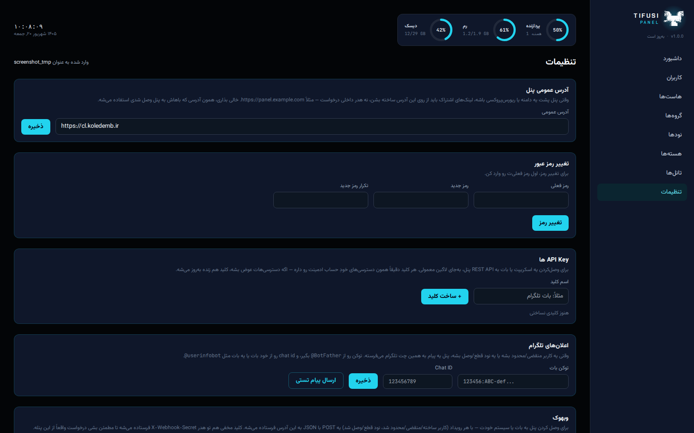

<p align="center">
  
</p>

<h1 align="center">TIFUSI PANEL</h1>

<hr>

<p align="center">
  <a href="https://github.com/javadtifusi-eng/Tifusi-Panel/stargazers"></a>
</p>

<p align="center">
  
  
  
  
  
  
  
</p>

<p align="center">
  🇬🇧 <a href="README.md">English</a> / 🇮🇷 <a href="README.fa.md">فارسی</a> / 🇷🇺 <b>Русский</b>
</p>

<hr>

Tifusi Panel — это панель управления прокси, которую вы разворачиваете на своём сервере: веб-дашборд плюс REST API, на FastAPI и React. Поддерживает VLESS, VMess, Trojan, Shadowsocks, Hysteria2, L2TP/IPsec и IKEv2/IPsec. WireGuard не поддерживается.

## Скриншоты

<p align="center">
  
  
</p>

## Возможности

- **Бэкенд** в `backend/`: FastAPI, асинхронный SQLAlchemy (по умолчанию SQLite), JWT-авторизация, миграции Alembic.
- **Фронтенд** в `frontend/`: React + Vite + Tailwind, светлая и тёмная тема, полностью двуязычный интерфейс (фарси/английский).
- **Пользователи** — создание, список, включение/отключение и удаление, по одному или пачкой. Лимиты трафика с отслеживанием реального потребления, автопереход в `истёк`/`ограничен`, отложенные аккаунты, у которых отсчёт начинается с первого подключения, а не с момента создания, опциональный лимит устройств на пользователя и сохранённые шаблоны, чтобы не вводить одни и те же параметры заново.
- **Хосты** для VLESS, VMess, Trojan, Shadowsocks, Hysteria2, L2TP и IKEv2. Протоколы на базе Xray выбирают Inbound, разобранный прямо из реального конфига Xray ядра — транспорт, безопасность и ключи REALITY берутся оттуда. Хосты L2TP/IKEv2 выбирают ядро с общим PSK.
- **Ядра** хранят либо полный сырой конфиг Xray (с визуальными редакторами маршрутизации, outbound'ов и DNS поверх него), либо общие настройки сервера L2TP/IKEv2, плюс список нод, на которых оно запущено.
- **Группы** — это настоящий контроль доступа, а не просто ярлык. Хост без группы виден всем; попав в группу, он становится виден только пользователям этой группы — как в их ссылках, так и в реальном конфиге, отправляемом на ноды.
- **Сканер REALITY** — проверяет задержку у примерно 160 доменов-кандидатов и предлагает самый быстрый прямо из формы хостов.
- **Ссылки подписки** — ссылка `vless://`, `vmess://`, `trojan://`, `ss://` или `hysteria2://` на каждый хост, простые поля подключения для L2TP/IKEv2, и одна ссылка подписки с QR-кодом, к которой клиентские приложения обращаются напрямую (клиенты Clash и sing-box получают настоящий конфиг вместо простого списка ссылок).
- **Ноды** — регистрируете сервер, выполняете команду установки, которую даёт панель, нажимаете «Синхронизировать» — и нода становится подключённой, с версией Xray. Дальше проверки состояния и сбор трафика идут сами.
- **Туннели** — публикуют зарубежный VPN-сервер через реле в Иране, так что зарубежному серверу никогда не нужен открытый входящий порт. Панель собирает тихую команду установки для каждой стороны и предлагает транспорт на основе реальной проверки задержки.
- **Учётные записи администраторов** — владелец может создавать дополнительных администраторов с ограниченными правами, и каждый администратор может выпускать API-ключи для скриптов и ботов вместо токена входа. Администраторы с ограниченным доступом видят только тех пользователей, которых создали сами.
- **Уведомления** — Telegram, Discord или обычный вебхук, на выбор (или все сразу), о событиях пользователей и нод.
- **Настройки** — публичный адрес и пароль администратора прямо из дашборда, загрузка TLS-сертификата, резервное копирование и восстановление в один клик. Ничего из этого не требует передеплоя.

Что ещё не сделано и какие более крупные идеи рассматриваются — смотрите в `ROADMAP.md`.

## Быстрая установка

**Панель** — сервер, на котором будут работать дашборд и API:
```bash
bash -c "$(curl -fsSL https://raw.githubusercontent.com/javadtifusi-eng/Tifusi-Panel/main/install.sh)"
```
Установит Docker, если его нет, склонирует репозиторий, предложит бесплатный сертификат Let's Encrypt, если на сервер указывает домен, и поднимет всё через Docker Compose. Учётную запись администратора вы создадите потом, в браузере — см. ниже.

**Нода** — любой сервер, который будет реально запускать Xray. Сначала создайте ноду на странице «Ноды» панели, чтобы получить её API-ключ:
```bash
bash -c "$(curl -fsSL https://raw.githubusercontent.com/javadtifusi-eng/Tifusi-Panel/main/install-node.sh)" -- <API_KEY> [PORT]
```
Устанавливает только агент ноды — ни панели, ни базы данных, ничего лишнего на этой машине.

Оба скрипта сами установят Docker, если его не хватает.

## Первый запуск

Не нужно искать команду в документации — страница входа сама показывает её, с кнопкой копирования.

1. Запустите стек: `docker compose up -d`
2. Откройте панель. Поскольку администратора ещё нет, она покажет карточку первоначальной настройки и команду для копирования.
3. Выполните эту команду на сервере:
   ```bash
   docker exec -it tifusi-panel tifusi-cli generate-admin-key
   ```
4. Вставьте выведенный ключ в ту же карточку, выберите имя пользователя и пароль — готово.

`install.sh` берёт на себя шаг 1 — шаги 2–4 проходят в браузере.

## Ноды и агент ноды

Нода — это сервер, на котором работает Xray. `backend/node_agent/` — небольшой сервис на FastAPI, который устанавливается на неё: панель отправляет сгенерированный конфиг на его эндпоинт `/config`, с авторизацией по индивидуальному API-ключу ноды, а агент перезапускает Xray с этим конфигом и сообщает о состоянии через `/health`.

```bash
docker build -t tifusi-node-agent -f backend/node_agent/Dockerfile backend
docker run -d --name tifusi-node --restart unless-stopped \
  -p 62050:62050 -e TIFUSI_NODE_API_KEY=<из команды установки ноды в панели> \
  tifusi-node-agent
```

Dockerfile агента при сборке скачивает настоящий бинарник Xray-core из релиза на GitHub, так что для сборки нужен исходящий доступ в интернет.

Hysteria2 вообще не часть Xray-core — это отдельный сервер, а L2TP/IKEv2 работают через strongSwan и xl2tpd. Все три просто не попадают в конфиг Xray, который панель отправляет на ноды, вместо того чтобы получить нерабочий inbound.

## Локальная разработка

**Бэкенд**
```bash
cd backend
pip install -r requirements.txt
uvicorn app.main:app --reload
```

**Фронтенд**
```bash
cd frontend
npm install
npm run dev
```
Dev-сервер Vite проксирует `/api` на `http://localhost:8000`.

**Сгенерировать ключ установки без Docker**
```bash
cd backend
python -m cli.main generate-admin-key
```

## Миграции базы данных

Изменения схемы проходят через Alembic, а не через `create_all()`. Приложение выполняет `alembic upgrade head` при каждом запуске, поэтому обычный деплой всегда приводит к последней схеме без ручных шагов.

При изменении модели создавайте миграцию вместе с ним:
```bash
cd backend
alembic revision --autogenerate -m "описание изменения"
```
Перед коммитом обязательно просмотрите сгенерированный файл — autogenerate делает большую часть работы, но для некоторых изменений столбцов SQLite нужен `op.batch_alter_table(...)`, который он сам не подставляет.

## Развёртывание через Docker

```bash
cp .env.example .env   # укажите настоящий TIFUSI_SECRET_KEY, и TIFUSI_PUBLIC_URL, если панель за прокси
docker compose up -d --build
```

- API панели: `http://localhost:8000`
- Дашборд: `http://localhost:8080`
- Данные SQLite хранятся в `./data`

Задайте `TIFUSI_PUBLIC_URL`, когда панель работает за прокси — без этого ссылки подписки строятся из заголовка Host запроса, а внутри контейнера это внутреннее имя, недоступное клиенту. Это лишь значение по умолчанию: в любой момент его можно посмотреть и изменить прямо из настроек панели, без передеплоя.

### HTTPS на дашборде (рекомендуется)

Контейнер `dashboard` может сам завершать TLS на порту 443 и проксировать `/api/` и `/sub/` на панель внутри сети. Именно это настраивает за вас шаг с доменом и Let's Encrypt в `install.sh`. Ещё два способа включить это позже:

- Из панели: Настройки → Сертификат SSL → загрузите `fullchain.pem` и `privkey.pem`. Заработает примерно через 15 секунд.
- Вручную: положите те же два файла в `./certs` на сервере.

В обоих случаях `./certs` постоянно отслеживается, так что nginx сам подхватывает новый или удалённый сертификат.

### Прямой TLS на панели (продвинутый вариант)

Если вы вообще не используете контейнер dashboard и хотите, чтобы TLS завершал сам uvicorn:

```bash
# в .env
TIFUSI_SSL_CERTFILE=/app/certs/fullchain.pem
TIFUSI_SSL_KEYFILE=/app/certs/privkey.pem
```

Раскомментируйте также строку `./certs:/app/certs:ro` в `docker-compose.yml`. Обе переменные нужно задать вместе — если задать только одну, приложение завершится с ошибкой при запуске вместо тихого отката на обычный HTTP.

## Благодарности

Эмблема грифона — собственный знак Tifusi, перенесён из `Tifusi-Tunnel`.
