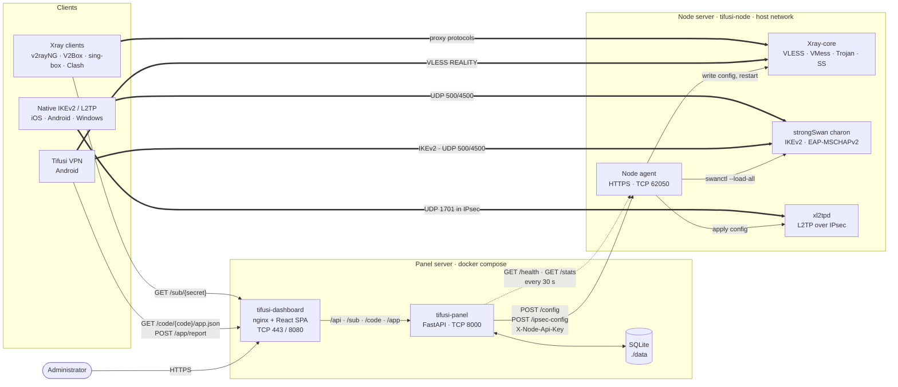
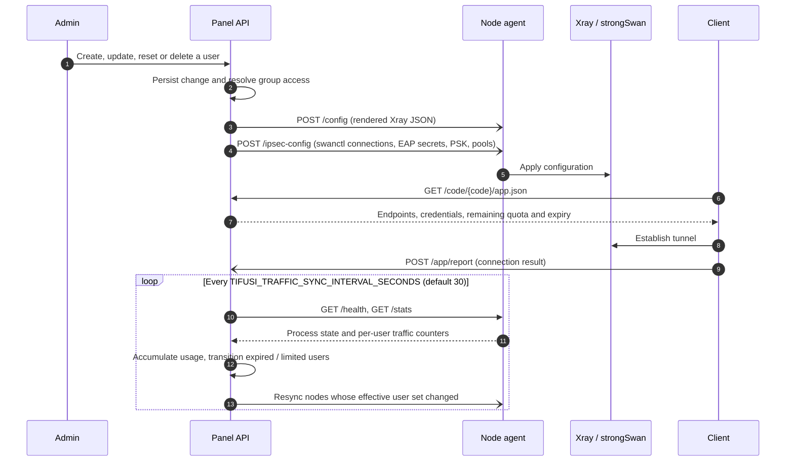

[← README](../../README.md) · [Installation](installation.md) · [Nodes](nodes.md) · [Cores & hosts](cores-and-hosts.md) · [Users](users-and-subscriptions.md) · [Resellers](resellers.md) · [Tunnels](tunnels.md) · [Telegram bot](telegram-bot.md) · [Android app](android-app.md) · [Operations](operations.md) · [Deployment](deployment.md) · **Architecture** · [Development](development.md)

# Architecture

## Components and data flow

Solid arrows are control-plane requests, dotted arrows are periodic polling, and thick arrows are data-plane traffic. The panel never proxies user traffic; clients connect directly to the node addresses published by hosts.

## Node synchronisation lifecycle

## Repository layout

| Path | Contents |
| --- | --- |
| `backend/app` | FastAPI application: routers, SQLAlchemy models, Xray config builder, subscription renderers, node sync, traffic accounting |
| `backend/alembic` | Database migrations |
| `backend/cli` | `tifusi-cli`, including first-run admin key generation |
| `backend/node_agent` | Node agent service, strongSwan/xl2tpd integration, node Dockerfile |
| `backend/tunnel_agent` | Relay agent for the Tunnels feature (Go) |
| `frontend` | React dashboard and nginx image |
| `install.sh`, `install-node.sh` | Panel and node installers |
| `manage.sh` | Operations menu, installed as `/usr/local/bin/tifusi-panel` and run as `tifusi panel` |
| `scripts/tifusi` | Shared `tifusi` launcher for Tifusi Panel, Tifusi Bot and the Tifusi VPN app |
| `.github/workflows/build-images.yml` | Builds and publishes panel, dashboard and node images to GHCR |

The dashboard is built with React 18, Vite and Tailwind CSS, localised in Persian (right-to-left) and English, with self-hosted Vazirmatn and Poppins typefaces.

---

[← Deployment](deployment.md) · [Development →](development.md)
