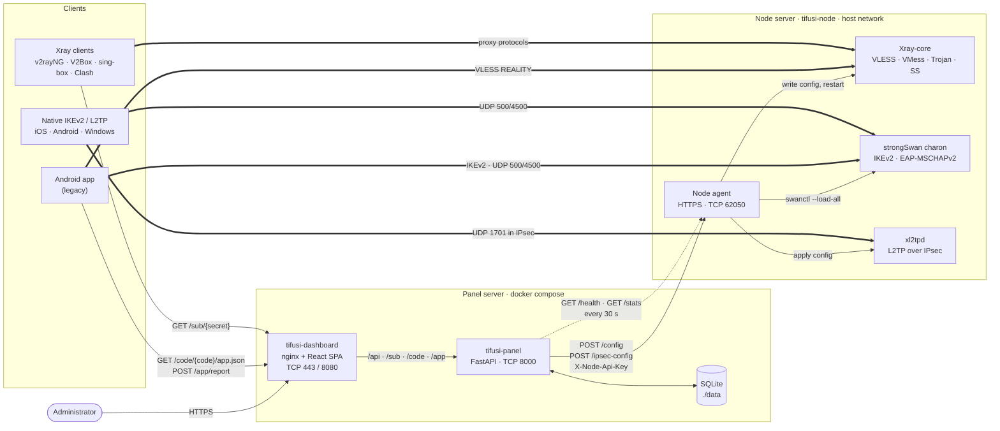
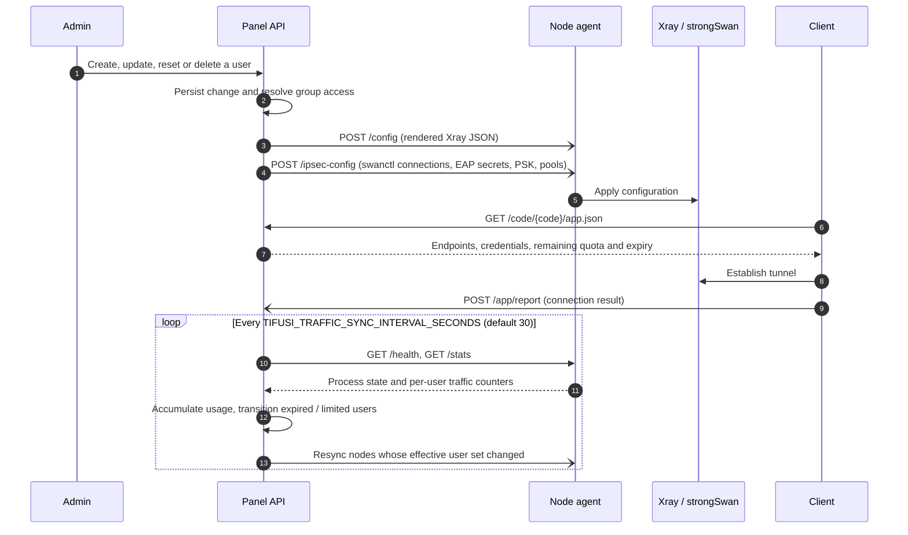

[← README](../../README.md) · 📦 [Installation](installation.md) · 🌐 [Nodes](nodes.md) · ⚛️ [Cores & hosts](cores-and-hosts.md) · 👤 [Users](users-and-subscriptions.md) · 💼 [Resellers](resellers.md) · 🚇 [Tunnels](tunnels.md) · 🛡️ [Connection Shield](connection-shield.md) · 🔀 [Domain rotation](domain-rotation.md) · ✈️ [Telegram bot](telegram-bot.md) · 📶 [Network health](network-health.md) · 🎛️ [Operations](operations.md) · 🔁 [Safe updates](updates-and-rollback.md) · 🚢 [Deployment](deployment.md) · 📐 **Architecture** · 💻 [Development](development.md)

# Architecture

## Components and data flow

```mermaid
flowchart LR
    Admin(["Administrator"])

    subgraph PanelHost["Panel server · docker compose"]
        direction TB
        Dash["tifusi-dashboard<br/>nginx + React SPA<br/>TCP 443 / 8080"]
        API["tifusi-panel<br/>FastAPI · TCP 8000"]
        DB[("SQLite<br/>./data")]
        Dash -->|"/api · /sub · /code · /app"| API
        API <--> DB
    end

    subgraph NodeHost["Node server · tifusi-node · host network"]
        direction TB
        Agent["Node agent<br/>HTTPS · TCP 62050"]
        Xray["Xray-core<br/>VLESS · VMess · Trojan · SS"]
        Swan["strongSwan charon<br/>IKEv2 · EAP-MSCHAPv2"]
        L2TP["xl2tpd<br/>L2TP over IPsec"]
        Agent -->|"write config, restart"| Xray
        Agent -->|"swanctl --load-all"| Swan
        Agent -->|"apply config"| L2TP
    end

    subgraph Clients["Clients"]
        direction TB
        App["Android app<br/>(legacy)"]
        XC["Xray clients<br/>v2rayNG · V2Box · sing-box · Clash"]
        Native["Native IKEv2 / L2TP<br/>iOS · Android · Windows"]
    end

    Admin -->|"HTTPS"| Dash
    API -->|"POST /config<br/>POST /ipsec-config<br/>X-Node-Api-Key"| Agent
    API -.->|"GET /health · GET /stats<br/>every 30 s"| Agent

    App -->|"GET /code/{code}/app.json<br/>POST /app/report"| Dash
    XC -->|"GET /sub/{secret}"| Dash
    App ==>|"VLESS REALITY"| Xray
    App ==>|"IKEv2 · UDP 500/4500"| Swan
    XC ==>|"proxy protocols"| Xray
    Native ==>|"UDP 500/4500"| Swan
    Native ==>|"UDP 1701 in IPsec"| L2TP
```

Solid arrows are control-plane requests, dotted arrows are periodic polling, and thick arrows are data-plane traffic. The panel never proxies user traffic; clients connect directly to the node addresses published by hosts.

## Node synchronisation lifecycle

```mermaid
sequenceDiagram
    autonumber
    participant Admin
    participant Panel as Panel API
    participant Agent as Node agent
    participant Core as Xray / strongSwan
    participant Client

    Admin->>Panel: Create, update, reset or delete a user
    Panel->>Panel: Persist change and resolve group access
    Panel-)Agent: POST /config (rendered Xray JSON)
    Panel-)Agent: POST /ipsec-config (swanctl connections, EAP secrets, PSK, pools)
    Agent->>Core: Apply configuration
    Client->>Panel: GET /code/{code}/app.json
    Panel-->>Client: Endpoints, credentials, remaining quota and expiry
    Client->>Core: Establish tunnel
    Client-)Panel: POST /app/report (connection result)
    loop Every TIFUSI_TRAFFIC_SYNC_INTERVAL_SECONDS (default 30)
        Panel->>Agent: GET /health, GET /stats
        Agent-->>Panel: Process state and per-user traffic counters
        Panel->>Panel: Accumulate usage, transition expired / limited users
        Panel-)Agent: Resync nodes whose effective user set changed
    end
```

## Repository layout

| Path | Contents |
| --- | --- |
| `backend/app` | FastAPI application: routers, SQLAlchemy models, Xray config builder, subscription renderers, node sync, traffic accounting, Connection Shield failover (`shield/`), network health (`network_health/`) |
| `backend/alembic` | Database migrations |
| `backend/cli` | `tifusi-cli`, including first-run admin key generation |
| `backend/node_agent` | Node agent service, strongSwan/xl2tpd integration, config validation and rollback (`safe_apply.py`), node Dockerfile |
| `backend/app/node_ssh` | Install, terminal and canary updates of nodes over SSH |
| `backend/app/tunnels` | Tunnel configs, offline bundles, install and update over SSH |
| `backend/tests` | pytest suite (see [Development](development.md#tests)) |
| `backend/tunnel_agent` | Relay agent for the Tunnels feature (Go) |
| `frontend` | React dashboard and nginx image |
| `install.sh`, `install-node.sh` | Panel and node installers |
| `manage.sh` | Operations menu, installed as `/usr/local/bin/tifusi-panel` and run as `tifusi panel` |
| `scripts/tifusi` | Shared `tifusi` launcher for Tifusi Panel, the node and Tifusi Bot |
| `.github/workflows/tests.yml` | Runs the test suite and the dashboard build on every push |
| `build-images.yml` (public repository) | Runs the tests, then builds and publishes panel, dashboard and node images to GHCR |

The dashboard is built with React 18, Vite and Tailwind CSS, localised in Persian (right-to-left) and English, with self-hosted Vazirmatn and Poppins typefaces.

---

[← Deployment](deployment.md) · [Development →](development.md)
