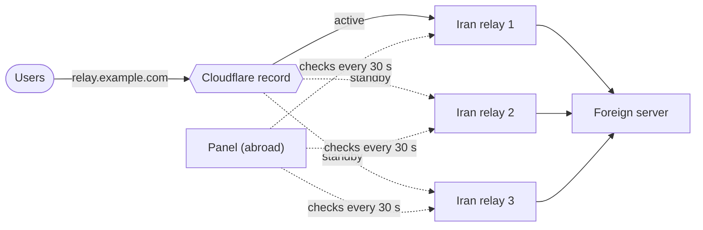

[← README](../../README.md) · 📦 [Installation](installation.md) · 🌐 [Nodes](nodes.md) · ⚛️ [Cores & hosts](cores-and-hosts.md) · 👤 [Users](users-and-subscriptions.md) · 💼 [Resellers](resellers.md) · 🚇 [Tunnels](tunnels.md) · 🛡️ **Connection Shield** · ✈️ [Telegram bot](telegram-bot.md) · 📱 [Android app](android-app.md) · 📶 [Network health](network-health.md) · 🎛️ [Operations](operations.md) · 🚢 [Deployment](deployment.md) · 📐 [Architecture](architecture.md) · 💻 [Development](development.md)

# Connection Shield

An Iran relay can lose international access at any moment. Until someone notices and moves users to another server, everyone on that relay is offline. Connection Shield does that move by itself: it keeps a group of relays for the same foreign server, watches them, and when the active one stops answering, sends users to the next healthy one — usually within two minutes, and in DNS mode without users doing anything.

It lives under **Settings → Connection Shield**.

## How it works

1. Every 30 seconds the panel opens a connection to each relay's public tunnel port from abroad.
2. When the **active** relay fails several checks in a row (three by default), it is marked **burnt** and users move to the next **standby** in the group's order that answered its last check.
3. A burnt relay that answers the same number of checks in a row again goes back to standby.
4. Every move, burn, recovery and error is listed under the group and sent to the Telegram, Discord and webhook notifications set up under Settings.

From outside Iran, a relay that lost international access and a relay that is switched off look the same — neither answers. Both need the same move, so the shield doesn't try to tell them apart.

## Two ways to move users

| Mode | What changes | What users need to do |
| --- | --- | --- |
| **Cloudflare DNS record** | The panel points one record, for example `relay.example.com`, at the new relay's address. | Nothing. Their configs already use that name and follow it within a minute. |
| **Host addresses** | Every host whose address is one of the group's relays is rewritten to the new relay. | Update the subscription. Until they do, the old address stays in their app. |

DNS mode is the one that makes a burnt relay invisible to users. For it:

- The hosts published to users must use the record name as their address, not a relay IP.
- The domain must be on Cloudflare. Create an API token with **Zone → DNS → Edit** on that zone; the panel checks the token when the group is saved and never shows it again.
- The record is created with a 60-second TTL if it doesn't exist. An existing record keeps its own TTL and proxy setting — set its TTL to 1 minute.
- A relay given by IPv4 address becomes an `A` record, IPv6 an `AAAA` record, a hostname a `CNAME`.

## Creating a group

| Setting | Purpose |
| --- | --- |
| Group name | Shown in the list and in notifications. |
| Failed checks | How many failed checks in a row mark a relay burnt. Lower reacts faster; higher tolerates short network blips. |
| Shield on | A group that is off is not checked and never moves users. |
| Mode | DNS record or host addresses, as above. |
| Relays | Tunnels from the Tunnels tab, in order of preference. The **first** one is taken to be the relay users are on now. |

Relays in one group should forward the same ports to the same foreign server, so that any of them can replace another. A tunnel can belong to one group only. `udp` tunnels can't be checked with a TCP connection and can't join a group.

## Buttons on a group

- **Check now** runs one check immediately instead of waiting for the next cycle.
- **Move here** on a standby or burnt relay moves users to it by hand. This clears its burnt mark — the admin may know better than three failed checks.
- **Edit** changes settings or the relay order. Removing the active relay makes the first remaining one active.

## What it doesn't do

- It doesn't stop a relay from being detected. It keeps users connected while you replace it: keep at least one standby, and add a new one when a relay burns — the group warns when no healthy standby is left.
- It watches the Iran relays, not the foreign server. If the foreign server itself is down, every relay in front of it still answers, and nothing moves.

## Settings

`TIFUSI_SHIELD_CHECK_INTERVAL_SECONDS` in `.env` sets how often relays are checked (default `30`).

---

[← Tunnels](tunnels.md) · [Telegram bot →](telegram-bot.md)
