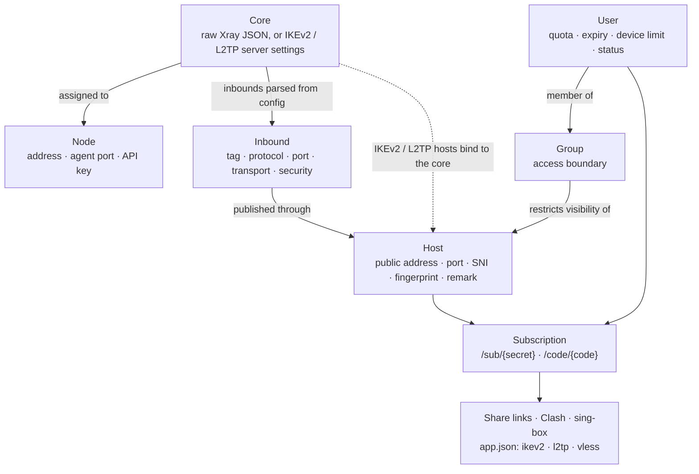

[← README](../../README.md) · 📦 [Installation](installation.md) · 🌐 [Nodes](nodes.md) · ⚛️ **Cores & hosts** · 👤 [Users](users-and-subscriptions.md) · 💼 [Resellers](resellers.md) · 🚇 [Tunnels](tunnels.md) · 🛡️ [Connection Shield](connection-shield.md) · ✈️ [Telegram bot](telegram-bot.md) · 📱 [Android app](android-app.md) · 📶 [Network health](network-health.md) · 🎛️ [Operations](operations.md) · 🚢 [Deployment](deployment.md) · 📐 [Architecture](architecture.md) · 💻 [Development](development.md)

# Cores, hosts and groups

## Configuration model

## Cores

A core is the server-side technology a node runs. It is one of three types:

| Type | Content |
| --- | --- |
| `xray` | A complete Xray JSON configuration, exactly what `xray run -c` accepts, with structured editors for routing, outbounds and DNS. Its inbounds are parsed out and become selectable by hosts and groups. |
| `ikev2` | The server parameters of an IKEv2/IPsec deployment: authentication mode (EAP-MSCHAPv2 or PSK), remote ID and server certificate. |
| `l2tp` | The server parameters of an L2TP/IPsec deployment, including the shared PSK. |

Each core can be assigned to one or more nodes. A node holds one Xray core and one IPsec core at the same time; see [Nodes](nodes.md#two-cores-on-one-node).

## Hosts

A host is the public endpoint a client receives: address, port and display name, for VLESS, VMess, Trojan, Shadowsocks, Hysteria2, L2TP and IKEv2.

- **Xray protocols** reference an inbound parsed from the core configuration and inherit transport, security and REALITY parameters from it. SNI, ALPN, fingerprint, path and security may be overridden for clients.
- **L2TP** hosts bind to an `l2tp` core and use its shared PSK.
- **IKEv2** hosts bind to an `ikev2` core. The server authenticates with an X.509 certificate (self-signed by default, or an imported CA-issued chain) and each user with EAP-MSCHAPv2.
- **Hysteria2** hosts carry their own parameters, since Hysteria2 runs outside the nodes.

### REALITY target scanner

**Find Best Target (SNI)** in the host form measures latency to approximately 160 candidate SNI domains and proposes the fastest one as the REALITY target.

## Groups

Groups are enforced access control, not folders. A host or inbound without a group is visible to all users. Once it is attached to one or more groups, it is included in subscriptions and in node configurations only for members of those groups, so group membership decides both the links a user receives and the credentials rendered onto the nodes.

---

[← Nodes](nodes.md) · [Users & subscriptions →](users-and-subscriptions.md)
