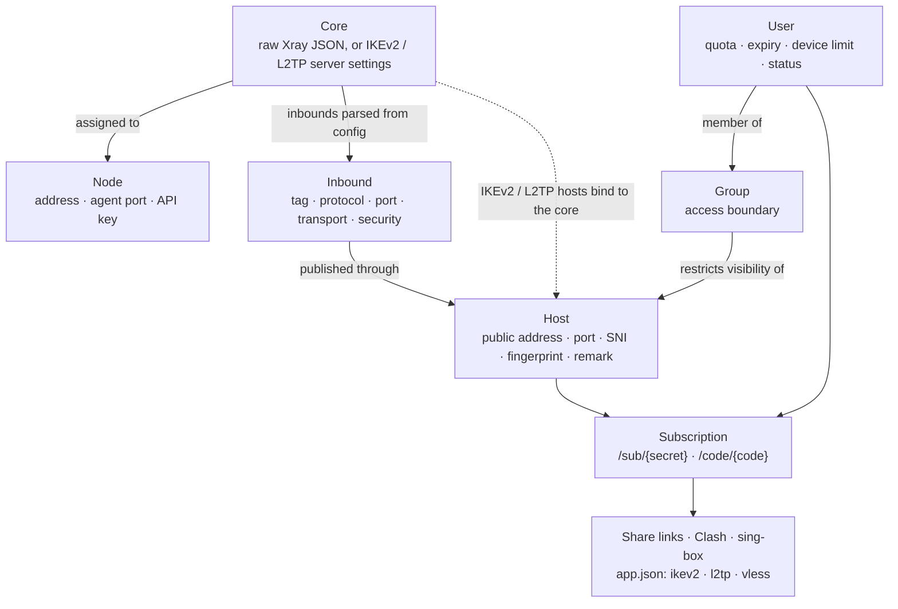

[← README](../../README.md) · 📦 [Installation](installation.md) · 🌐 [Nodes](nodes.md) · ⚛️ **Cores & hosts** · 👤 [Users](users-and-subscriptions.md) · 💼 [Resellers](resellers.md) · 🚇 [Tunnels](tunnels.md) · 🛡️ [Connection Shield](connection-shield.md) · ✈️ [Telegram bot](telegram-bot.md) · 📱 [Android app](android-app.md) · 📶 [Network health](network-health.md) · 🎛️ [Operations](operations.md) · 🚢 [Deployment](deployment.md) · 📐 [Architecture](architecture.md) · 💻 [Development](development.md)

# Cores, hosts and groups

## Configuration model

## Cores

A core is the server-side technology a node runs. It is one of three types:

| Type | Content |
| --- | --- |
| `xray` | A complete Xray JSON configuration, exactly what `xray run -c` accepts, with structured editors for routing, outbounds and DNS. Its inbounds are parsed out and become selectable by hosts and groups. |
| `ikev2` | The server parameters of an IKEv2/IPsec deployment: authentication mode (EAP-MSCHAPv2 or PSK), remote ID and server certificate. |
| `l2tp` | The server parameters of an L2TP/IPsec deployment, including the shared PSK. |

Each core can be assigned to one or more nodes. A node holds one Xray core and one IPsec core at the same time; see [Nodes](nodes.md#two-cores-on-one-node).

## Hosts

A host is the public endpoint a client receives: address, port and display name, for VLESS, VMess, Trojan, Shadowsocks, Hysteria2, L2TP and IKEv2.

- **Xray protocols** reference an inbound parsed from the core configuration and inherit transport, security and REALITY parameters from it. SNI, ALPN, fingerprint, path and security may be overridden for clients.
- **L2TP** hosts bind to an `l2tp` core and use its shared PSK.
- **IKEv2** hosts bind to an `ikev2` core. The server authenticates with an X.509 certificate (self-signed by default, or an imported CA-issued chain) and each user with EAP-MSCHAPv2.
- **Hysteria2** hosts carry their own parameters, since Hysteria2 runs outside the nodes.

### REALITY target scanner

**Find Best Target (SNI)** in the REALITY section of the Xray core form opens the scanner. It runs on a node you pick, because the node is what forwards handshakes to the target.

There is no built-in list of names: a target published in a panel's source is the first one a censor blocks, and a name that is excellent on one server's network is ordinary on another's. Every scan discovers its own names live, and every scan walks one ring further out, so pressing the button again turns up sites the last round never showed.

1. **Find** — the node reads the names off the certificates of every address in a /24 near it. Round 1 is its own /24, round 2 the /24s either side of it, and so on; names found in earlier rounds are skipped.
2. **Check** — each name must answer with TLS 1.3 and HTTP/2 and a certificate valid for that name, and its own DNS must point back at the address it was found on. Neighbours are reached by their address, which becomes the `dest` (`IP:443`). Each survivor is then timed from the node, by IP and with no DNS in the timing, one at a time once the checks are over: **ping** is the median of five TCP connects and **TLS** the median of three full handshakes.
3. **Iran** — probe servers inside Iran (Tehran, Isfahan, Shiraz, Qom, via check-host.net) are asked to open each survivor, and to reach the node's own address. Only the name or the node address is sent. This is a gate, not a label: a name that is not open from *every* city that answered is dropped, because it cannot be used whatever else it scores. Each city also reports how long it took, and the median of those is the scan's speed signal — many names are open from Iran yet slow, and a slow target makes a slow tunnel.
4. **Prove** — the handful that are open from Iran, fastest first, get a real REALITY server and client started on the node, which load a page through them once per fingerprint (chrome, firefox, safari, ios, android, edge, 360, qq, random, randomized). ✓ means that fingerprint really connected; the fingerprints are listed fastest first, each with its own measured time.
5. **Test from Iran** — the definitive speed measurement, started automatically when a scan finishes. Iranian DPI throttles names it does not block, so no test outside Iran can rank targets by the speed a user will see. The node opens one throwaway REALITY inbound per target for 30 minutes; import the subscription on a phone on Iranian internet, run a speed test on each config, and the real download and upload rate of each target appears in the panel, fastest first.

Results are ordered by speed throughout: working with chrome and sitting on the node's own network first, then how fast Iran answers, then the node→target handshake REALITY waits on for every new connection.

**Use** writes the name into `serverNames` and the `dest` into the core's JSON. The scanner needs a node updated to v1.4.2 or later, which also runs Xray 26: on Xray 1.8 the chrome, firefox and safari fingerprints fail against REALITY.

## Groups

Groups are enforced access control, not folders. A host or inbound without a group is visible to all users. Once it is attached to one or more groups, it is included in subscriptions and in node configurations only for members of those groups, so group membership decides both the links a user receives and the credentials rendered onto the nodes.

---

[← Nodes](nodes.md) · [Users & subscriptions →](users-and-subscriptions.md)
