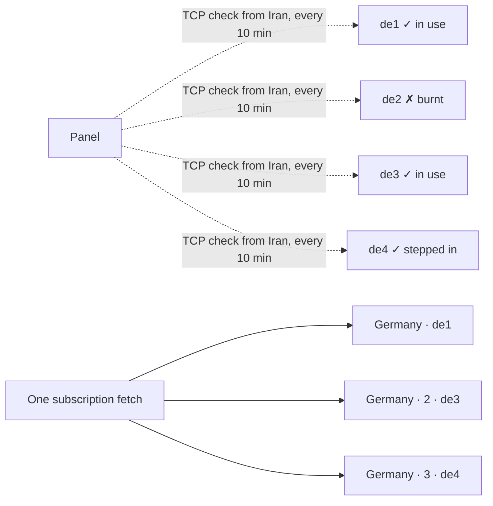

[← README](../../README.md) · 📦 [Installation](installation.md) · 🌐 [Nodes](nodes.md) · ⚛️ [Cores & hosts](cores-and-hosts.md) · 👤 [Users](users-and-subscriptions.md) · 💼 [Resellers](resellers.md) · 🚇 [Tunnels](tunnels.md) · 🛡️ [Connection Shield](connection-shield.md) · 🔀 **Domain rotation** · ✈️ [Telegram bot](telegram-bot.md) · 📶 [Network health](network-health.md) · 🎛️ [Operations](operations.md) · 🔁 [Safe updates](updates-and-rollback.md) · 🚢 [Deployment](deployment.md) · 📐 [Architecture](architecture.md) · 💻 [Development](development.md)

# Domain rotation

A domain can be filtered in Iran at any moment. Store clients — v2rayNG, V2Box, Streisand — keep the one subscription address they were given and have no standard way to learn another, so once a name is filtered, nothing the panel changes afterwards reaches them. Domain rotation works around that in two layers, both carried **inside the subscription the user already has**:

| Layer | What it does | Works in |
| --- | --- | --- |
| **Domain pools** | Each pooled host goes out on several healthy domains at once. When one is filtered, configs on the others are already on the phone. | every client |
| **Backup addresses inside the subscription** | The other addresses of the subscription itself are put in its body. | Clash/Mihomo fetch from them on their own; v2rayNG/V2Box show them as an info entry |

Only what a subscription delivers rotates: VLESS, VMess, Trojan, Shadowsocks and Hysteria2. IKEv2, L2TP and PPTP are typed into the phone by hand and WireGuard is a `.conf` file, so the panel won't attach them to a pool and their address never changes under them.

## Domain pools

**Hosts → 🌐 Domain pools.** A pool is a list of interchangeable addresses for the same servers, in order of preference.

| Setting | Purpose |
| --- | --- |
| Type | **Direct**: each name points at the server (A/AAAA/CNAME). **CDN**: each name reaches the same origin through Arvan, Cloudflare or another CDN; clean edge IPs are accepted too. |
| Configs per host | How many healthy domains go into each subscription at once (default 3). The rest stand by. |
| Port checked from Iran | The TCP port tested on each domain (default 443). |
| Failed checks in a row | How many failed checks burn a domain (default 3); as many passing checks bring it back. |

Then pick the pool on a host (**Domain pool** in the host form). The host goes out once per handed-out domain — `Germany`, `Germany · 2`, `Germany · 3` — and the address typed on the host is only used if the pool has no healthy domain left; a host never disappears from subscriptions.

### What changes on each copy

- The **address** always becomes the pool domain.
- The **TLS name (SNI)** and **Host header** follow it when they were the host's own address, and on a CDN pool also when they were empty (the CDN routes by them).
- Names set to something else on purpose are kept — for example a host that dials a clean edge (`snapp.ir`) but presents its real name in SNI and Host keeps that name on every copy.

For a direct pool with TLS, the server's certificate must cover every name in the pool.

### Health and rotation

Every 10 minutes the panel asks check-host.net's Iranian nodes to open a TCP connection to each domain on the check port. A domain most of them reach is healthy. That catches the two usual ways a name dies in Iran — a poisoned DNS answer or a dropped address; SNI-based blocking of an otherwise reachable name is not visible to a TCP check.

1. A domain that fails the set number of checks in a row is marked **burnt** and drops out of subscriptions; the next standby in the pool's order takes its place on the next fetch.
2. A burnt domain that passes as many checks in a row is back.
3. When fewer healthy domains are left than the pool hands out, a **running low** notice goes out once.
4. Every burn, recovery and notice is listed under the pool and sent to the Telegram, Discord and webhook notifications from Settings.

Buttons on a pool: **Check from Iran** (about fifteen seconds), **Burn** a domain you know is filtered, **Restore** one, **Disable** one (never checked, never handed out), **Edit** (the domain order is the order of preference; a domain that stays keeps its state), **Delete** (hosts go back to their own address).

### What users see

- **v2rayNG, V2Box, Streisand**: the copies as separate configs. When one stops connecting, the user picks another — without updating the subscription. On the next update the burnt domain is replaced.
- **Clash / Mihomo**: the copies in the `auto` url-test group, which moves to a working one by itself.
- **sing-box (SFA, SFI, Hiddify)**: an `auto` urltest outbound over all configs, selected by default, which does the same.

## Backup addresses inside the subscription

Backup subscription domains live under **Settings → Subscription domains**: names pointing at the panel, each with its own certificate, health-checked from Iran, promoted automatically when the main one fails (optional). By default they are hidden — only the Tifusi app learns them, from `app.json`.

**Inside the subscription itself** puts them in the subscription body:

- **Clash / Mihomo**: each address (the main one and every backup with a certificate, minus the one the fetch came in on) becomes a `proxy-provider`. The client fetches and refreshes them on its own, so when the address the profile was added from is filtered, the proxies keep coming from a backup and `auto` moves to them.
- **v2rayNG / V2Box**: one info entry per address, a config that can't connect whose name is `📎 لینک پشتیبان اشتراک: https://…/sub/…`. Plain base64 subscriptions have no field for another subscription address; this is where the user can read it.

The switch is off by default: once on, anyone holding a subscription link can see the backup domains, which the hidden design otherwise avoids.

## Settings

The check runs every 10 minutes for every enabled pool. The probe uses check-host.net from the panel; no node or agent update is needed.

---

[← Connection Shield](connection-shield.md) · [Telegram bot →](telegram-bot.md)
