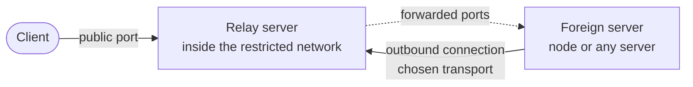

[← README](../../README.md) · 📦 [Installation](installation.md) · 🌐 [Nodes](nodes.md) · ⚛️ [Cores & hosts](cores-and-hosts.md) · 👤 [Users](users-and-subscriptions.md) · 💼 [Resellers](resellers.md) · 🚇 **Tunnels** · 🛡️ [Connection Shield](connection-shield.md) · ✈️ [Telegram bot](telegram-bot.md) · 📱 [Android app](android-app.md) · 📶 [Network health](network-health.md) · 🎛️ [Operations](operations.md) · 🚢 [Deployment](deployment.md) · 📐 [Architecture](architecture.md) · 💻 [Development](development.md)

# Tunnels

A tunnel publishes a server abroad through a relay server inside a restricted network. Clients connect to the relay; the foreign server dials out to the relay, so it needs no open inbound port of its own.

The relay runs as its own agent on both servers. The panel stores the tunnel's configuration and generates the install command for each side, so the token and port map are never typed twice; it does not manage the agent after installation.

## Creating a tunnel

| Setting | Purpose |
| --- | --- |
| Relay address and port | The public listener clients connect to. The port defaults to `8443`. |
| Foreign side | A node already registered in the panel, whose address is reused, or any other server by address. |
| Transport | How the foreign side connects to the relay (see below). |
| SNI and domain | For `tls`, `wss` and `wssmux`. A domain can be issued a Let's Encrypt certificate during installation. |
| Path | For `ws`, `wss`, `wsmux` and `wssmux`. |
| Connection count | How many physical connections the foreign side keeps open. Defaults to `8`. |
| Forwarded ports | Named port mappings, each TCP or UDP, from a relay port to a port on the foreign server. |

A token is generated automatically for each tunnel.

### Transports

The form offers three:

| Transport | Use |
| --- | --- |
| **TCP Mux** (`tcpmux`) | Fastest; the foreign server connects straight to the relay. |
| **WSS Mux** (`wssmux`) | WebSocket over TLS. The most filter-resistant, and the only one a CDN carries. |
| **UDP (KCP)** (`udp`) | For links where TCP is disrupted. |

Tunnels created earlier with `tcp`, `tls`, `ws`, `wss` or `wsmux` keep working; editing one shows its transport as a legacy card.

## Through a CDN

With **WSS Mux** selected, **Route through a CDN** makes the foreign server dial a CDN name instead of the relay's IP, so the tunnel survives if that IP is filtered. ArvanCloud is the recommended provider inside Iran; Cloudflare also works.

1. Tick **Route through a CDN**, choose ArvanCloud or Cloudflare and enter the domain you will point at the relay.
2. The panel sets the SNI to that domain, picks a random WebSocket path and fixes the port: ArvanCloud keeps the relay's port as the origin port; Cloudflare only proxies 443, 2053, 2083, 2087, 2096 and 8443, and reaches the relay on the same port, so the relay port follows your choice.
3. Follow the checklist under the form: an A record to the relay with the CDN proxy on, HTTPS to the origin on the tunnel port (Full SSL on Cloudflare), and WebSocket on.
4. **Test connection** adds a **CDN path** step: the panel opens a real WebSocket upgrade through the CDN to the relay and turns green only on a `101` answer.

ArvanCloud bills traffic that passes through it, so everything the tunnel carries counts.

### CDN quality

**⚡ ArvanCloud quality** on a CDN tunnel's card opens three real checks. They run on the foreign server when it is a panel node (the machine that actually dials the CDN), otherwise on the panel server, and the sheet says which.

- **Clean IPs.** About 128 edge addresses spread across the provider's published ranges are each tried with a real WebSocket upgrade through to your relay; the ten fastest are re-tried three times and listed with their median time, spread and how many of the three succeeded. The best three are ticked. Saved edges go into the foreign config as `servers`: the tunnel spreads its connections across them and skips one that stops answering.
- **Front SNI (domain fronting).** Well-known Iranian sites are resolved to see which really sit on the same CDN, then each is tried as the TLS name while the WebSocket `Host` stays your domain. Only the ones that actually carried the connection to your relay are offered. With one chosen, the foreign side's TLS names that site and the CDN routes on `Host`.
- **Real speed test.** Downloads 8 MB from the relay through the CDN over the tunnel's own protocol, using the saved edge and SNI, and reports Mbps and ping. Run it before and after a change.

After **Save**, the sheet shows the foreign install command; run it once on the foreign server to apply the new edges and SNI. The speed test needs the updated tunnel program on the Iran server too, so re-run the relay's install command once as well.

With the CDN option ticked the form also raises the connection count from 8 to 16, since a CDN limits each connection's speed.

## Choosing a transport

Before the tunnel exists, **Recommend best transport** probes both servers and reports reachability and latency to each, then ranks the transports. The ranking reflects what can honestly be measured from outside the restricted network; it cannot predict how a particular filter will treat each transport, so test the chosen one after installation.

## Installing and testing

1. Open the tunnel and copy the install command for each side.
2. Run the relay command on the relay server and the foreign command on the foreign server.
3. Select **Test connection**. The panel checks that it can reach the relay server, the foreign server and the tunnel's public port, and records the tunnel as `connected` or `error` with the latency and time of the check. A `udp` tunnel cannot be checked from outside; its service log is read on the relay server with `journalctl -u tifusi`.

## Spoof test

Some tunnel types depend on the relay's datacenter allowing packets with a forged source address to leave its network. The **IP Spoofing** card in the transport picker generates two commands, one for each server, that check this before any such tunnel is built. Nothing runs on the servers until the commands are executed there.

## Tunnels and IKEv2 or L2TP

For native IKEv2 or L2TP through a tunnel, forward UDP 500 and 4500 from the relay to the foreign server, and UDP 1701 as well for L2TP clients without IPsec. The host published to users then points at the relay's address.

---

[← Resellers](resellers.md) · [Connection Shield →](connection-shield.md)
