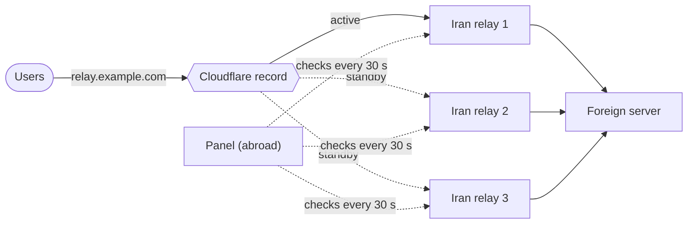

[→ صفحه‌ی اصلی](../../README.fa.md) · 📦 [نصب](installation.md) · 🌐 [نودها](nodes.md) · ⚛️ [هسته‌ها و هاست‌ها](cores-and-hosts.md) · 👤 [کاربران](users-and-subscriptions.md) · 💼 [نمایندگان](resellers.md) · 🚇 [تانل‌ها](tunnels.md) · 🛡️ **سپر اتصال** · ✈️ [ربات تلگرام](telegram-bot.md) · 📱 [اپ اندروید](android-app.md) · 📶 [سلامت شبکه](network-health.md) · 🎛️ [مدیریت](operations.md) · 🚢 [مرجع استقرار](deployment.md) · 📐 [معماری](architecture.md) · 💻 [توسعه](development.md)

# سپر اتصال

رله‌ی ایران هر لحظه ممکن است ایران‌اکسس شود. تا وقتی کسی متوجه شود و کاربرها را به سرور دیگری ببرد، همه‌ی کاربران آن رله قطع‌اند. سپر اتصال این جابه‌جایی را خودش انجام می‌دهد: چند رله برای یک سرور خارج نگه می‌دارد، مدام آن‌ها را بررسی می‌کند و وقتی رله‌ی فعال جواب ندهد، کاربرها را به رله‌ی سالم بعدی می‌برد — معمولاً در کمتر از دو دقیقه، و در حالت DNS بدون اینکه کاربر کاری بکند.

این بخش در **تنظیمات ← سپر اتصال** است.

## چطور کار می‌کند

1. پنل هر ۳۰ ثانیه از خارج به پورت عمومی تانل هر رله وصل می‌شود.
2. وقتی رله‌ی **فعال** چند بار پشت سر هم (پیش‌فرض سه بار) جواب ندهد، **سوخته** حساب می‌شود و کاربرها به اولین رله‌ی **جانشین** در ترتیب گروه که در آخرین بررسی جواب داده منتقل می‌شوند.
3. رله‌ی سوخته اگر دوباره به همان تعداد پشت سر هم جواب بدهد، به جانشین برمی‌گردد.
4. هر جابه‌جایی، سوختن، برگشتن و خطا زیر گروه ثبت می‌شود و به اعلان‌های تلگرام، دیسکورد و وبهوکی که در تنظیمات فعال کرده‌اید فرستاده می‌شود.

از بیرون ایران، رله‌ای که ایران‌اکسس شده و رله‌ای که خاموش است یک شکل دیده می‌شوند — هیچ‌کدام جواب نمی‌دهند. هر دو هم به همان جابه‌جایی نیاز دارند، پس سپر سعی نمی‌کند این دو را از هم جدا کند.

## دو روش جابه‌جایی

| روش | چه چیزی عوض می‌شود | کاربر چه کاری باید بکند |
| --- | --- | --- |
| **رکورد DNS در کلادفلر** | پنل یک رکورد، مثلاً `relay.example.com`، را به نشانی رله‌ی جدید می‌برد. | هیچ کاری. کانفیگش از قبل همین نام را دارد و ظرف یک دقیقه دنبالش می‌رود. |
| **آدرس هاست‌ها** | نشانی هر هاستی که به یکی از رله‌های گروه اشاره می‌کند به رله‌ی جدید تغییر می‌کند. | ساب را آپدیت کند. تا آن موقع نشانی قبلی در اپش می‌ماند. |

روش DNS همان روشی است که سوختن رله را از چشم کاربر پنهان می‌کند. برای آن:

- هاست‌هایی که به کاربرها داده می‌شود باید نام رکورد را به‌عنوان نشانی داشته باشند، نه IP رله.
- دامنه باید روی کلادفلر باشد. یک API Token با دسترسی **Zone → DNS → Edit** برای همان دامنه بسازید؛ پنل موقع ذخیره‌ی گروه توکن را امتحان می‌کند و دیگر آن را نشان نمی‌دهد.
- اگر رکورد وجود نداشته باشد با TTL شصت ثانیه ساخته می‌شود. رکوردی که از قبل هست TTL و وضعیت پروکسی خودش را نگه می‌دارد — TTL آن را روی ۱ دقیقه بگذارید.
- رله‌ای که با IPv4 تعریف شده رکورد `A`، با IPv6 رکورد `AAAA` و با نام دامنه رکورد `CNAME` می‌گیرد.

## ساختن گروه

| تنظیم | کاربرد |
| --- | --- |
| نام گروه | در فهرست و در اعلان‌ها نمایش داده می‌شود. |
| تعداد خطا | چند بار جواب ندادن پشت سر هم تا رله سوخته حساب شود. عدد کمتر سریع‌تر واکنش نشان می‌دهد؛ عدد بیشتر قطعی‌های کوتاه شبکه را نادیده می‌گیرد. |
| سپر روشن باشد | گروه خاموش بررسی نمی‌شود و کاربری را جابه‌جا نمی‌کند. |
| روش جابه‌جایی | رکورد DNS یا آدرس هاست‌ها، طبق جدول بالا. |
| رله‌ها | تانل‌های تب تانل‌ها، به ترتیب اولویت. **اولی** همان رله‌ای است که کاربرها الان به آن وصل‌اند. |

رله‌های یک گروه باید همان پورت‌ها را به همان سرور خارج فوروارد کنند تا هر کدام بتواند جای دیگری را بگیرد. هر تانل فقط در یک گروه می‌تواند باشد. تانل‌های `udp` را نمی‌شود با اتصال TCP بررسی کرد و وارد گروه نمی‌شوند.

## دکمه‌های هر گروه

- **بررسی الان** یک بررسی را همان لحظه انجام می‌دهد و منتظر دور بعد نمی‌ماند.
- **انتقال به اینجا** روی رله‌ی جانشین یا سوخته، کاربرها را دستی به آن می‌برد و علامت سوخته را برمی‌دارد — ادمین ممکن است بهتر از سه بررسی ناموفق بداند.
- **ویرایش** تنظیمات یا ترتیب رله‌ها را عوض می‌کند. اگر رله‌ی فعال از گروه برداشته شود، اولین رله‌ی باقی‌مانده فعال می‌شود.

## چه کاری نمی‌کند

- جلوی شناسایی شدن رله را نمی‌گیرد؛ کاربرها را وصل نگه می‌دارد تا رله را عوض کنید. همیشه دست‌کم یک جانشین داشته باشید و وقتی رله‌ای سوخت، رله‌ی تازه اضافه کنید — وقتی جانشین سالمی نماند گروه هشدار می‌دهد.
- رله‌های ایران را بررسی می‌کند، نه سرور خارج را. اگر خود سرور خارج از کار بیفتد، رله‌های جلوی آن هنوز جواب می‌دهند و جابه‌جایی‌ای انجام نمی‌شود.

## تنظیم

متغیر `TIFUSI_SHIELD_CHECK_INTERVAL_SECONDS` در فایل `.env` فاصله‌ی بررسی رله‌ها را تعیین می‌کند (پیش‌فرض `30`).

---

[→ تانل‌ها](tunnels.md) · [ربات تلگرام ←](telegram-bot.md)

