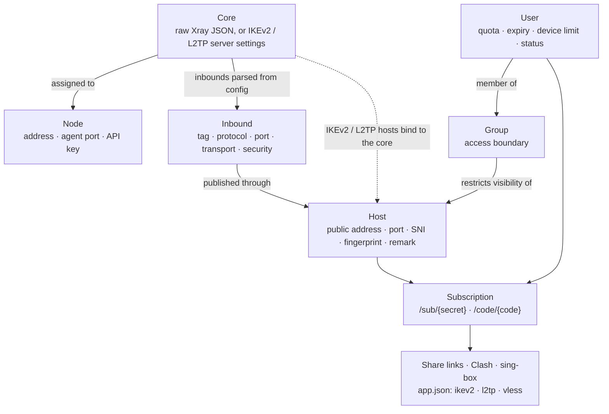

[→ صفحه‌ی اصلی](../../README.fa.md) · 📦 [نصب](installation.md) · 🌐 [نودها](nodes.md) · ⚛️ **هسته‌ها و هاست‌ها** · 👤 [کاربران](users-and-subscriptions.md) · 💼 [نمایندگان](resellers.md) · 🚇 [تانل‌ها](tunnels.md) · 🛡️ [سپر اتصال](connection-shield.md) · ✈️ [ربات تلگرام](telegram-bot.md) · 📱 [اپ اندروید](android-app.md) · 📶 [سلامت شبکه](network-health.md) · 🎛️ [مدیریت](operations.md) · 🚢 [مرجع استقرار](deployment.md) · 📐 [معماری](architecture.md) · 💻 [توسعه](development.md)

# هسته‌ها، هاست‌ها و گروه‌ها

## مدل پیکربندی

## هسته‌ها

هسته فناوری سمت سروری است که روی نود اجرا می‌شود و یکی از سه نوع زیر است:

| نوع | محتوا |
| --- | --- |
| `xray` | یک پیکربندی کامل Xray به‌صورت JSON، دقیقاً همان چیزی که `xray run -c` می‌پذیرد، همراه با ویرایشگرهای ساخت‌یافته برای routing، outbounds و DNS. inboundهای آن استخراج شده و برای هاست‌ها و گروه‌ها قابل انتخاب می‌شوند. |
| `ikev2` | پارامترهای سرور IKEv2/IPsec: حالت احراز هویت (EAP-MSCHAPv2 یا PSK)، شناسه‌ی راه دور (Remote ID) و گواهی سرور. |
| `l2tp` | پارامترهای سرور L2TP/IPsec، از جمله PSK مشترک. |

هر هسته را می‌توان به یک یا چند نود تخصیص داد. هر نود هم‌زمان یک هسته‌ی Xray و یک هسته‌ی IPsec دارد؛ بخش [دو هسته روی یک نود](nodes.md) را ببینید.

## هاست‌ها

هاست نقطه‌ی اتصال عمومی است که کلاینت دریافت می‌کند: نشانی، پورت و نام نمایشی، برای VLESS، VMess، Trojan، Shadowsocks، Hysteria2، L2TP و IKEv2.

- **پروتکل‌های Xray** به یک inbound استخراج‌شده از پیکربندی هسته ارجاع می‌دهند و پارامترهای transport، security و REALITY را از آن به ارث می‌برند. SNI، ALPN، fingerprint، path و security را می‌توان برای کلاینت‌ها بازنویسی کرد.
- هاست‌های **L2TP** به یک هسته‌ی `l2tp` متصل می‌شوند و از PSK مشترک آن استفاده می‌کنند.
- هاست‌های **IKEv2** به یک هسته‌ی `ikev2` متصل می‌شوند. سرور با گواهی X.509 (به‌طور پیش‌فرض خودامضا، یا زنجیره‌ی صادرشده توسط CA) و هر کاربر با EAP-MSCHAPv2 احراز هویت می‌شود.
- هاست‌های **Hysteria2** پارامترهای خود را نگه می‌دارند، زیرا Hysteria2 بیرون از نودها اجرا می‌شود.

### یافتن بهترین تارگت REALITY

دکمه‌ی **پیدا کردن بهترین تارگت (SNI)** در بخش REALITY فرم هسته‌ی Xray، اسکنر را باز می‌کند. اسکن روی نودی که انتخاب می‌کنید انجام می‌شود، چون نود است که handshake را به تارگت می‌فرستد:

1. **پیدا کردن** — *همسایه‌های نود* اسم سایت‌ها را از گواهی همه‌ی IPهای همان /24 نود می‌خواند؛ یعنی سایت‌های همان دیتاسنتر (سریع، و همان روشی که سازندگان Xray پیشنهاد می‌کنند). *سایت‌های معروف* از فهرست حدود ۱۶۰ سایت بزرگ استفاده می‌کند. *سرور جدید (قبل از نود)* IP سروری را که هنوز اضافه نکرده‌اید می‌گیرد و یک دستور یک‌خطی می‌دهد که روی همان سرور اجرا کنید؛ این دستور اسکنر نود را روی آن سرور اجرا می‌کند (با Docker که اگر نباشد نصب می‌شود) و نتیجه را به پنل می‌فرستد، تا قبل از نود کردن سرور درباره‌اش تصمیم بگیرید.
2. **بررسی** — هر سایت باید TLS 1.3 و HTTP/2 و گواهی معتبر برای همان اسم داشته باشد. همسایه‌ها با IP خودشان وصل می‌شوند و همان IP به‌عنوان `dest` (`IP:443`) گذاشته می‌شود. سپس هر سایت مناسب از روی نود، با IP و بدون DNS، بعد از پایان بررسی‌ها و یکی‌یکی زمان‌سنجی می‌شود: **ping** میانه‌ی ۵ اتصال TCP و **TLS** میانه‌ی ۳ هندشیک کامل است. REALITY برای هر اتصال جدید منتظر همین هندشیک است، پس فهرست به این ترتیب مرتب می‌شود: اول باز بودن از ایران، بعد کار کردن با chrome، بعد کوتاه‌ترین هندشیک.
3. **اثبات** — برای بهترین‌ها، نود یک سرور و کلاینت REALITY واقعی راه می‌اندازد و با هر fingerprint (chrome، firefox، safari، ios، android، edge، 360، qq، random، randomized) یک صفحه را از داخل آن باز می‌کند. ✓ یعنی با آن fingerprint واقعاً وصل شد و ✕ یعنی نشد.
4. **ایران** — پنل از سرورهای تست داخل ایران (تهران، اصفهان، شیراز و قم، از طریق check-host.net) می‌پرسد که هر سایت آنجا باز می‌شود یا نه، و اینکه IP خود نود از ایران در دسترس است یا نه. فقط اسم سایت یا آدرس نود فرستاده می‌شود. سایت‌هایی که در ایران فیلترند آخر فهرست می‌آیند.

دکمه‌ی **انتخاب** اسم را در `serverNames` و `dest` را در JSON هسته می‌گذارد. اسکنر به نود نسخه‌ی 1.4.1 یا جدیدتر نیاز دارد که Xray 26 هم دارد؛ روی Xray 1.8 اتصال REALITY با fingerprintهای chrome، firefox و safari کار نمی‌کند.

## گروه‌ها

گروه‌ها کنترل دسترسی واقعی‌اند، نه صرفاً دسته‌بندی. هاست یا inbound بدون گروه برای همه‌ی کاربران قابل مشاهده است. پس از اتصال به یک یا چند گروه، فقط برای اعضای همان گروه‌ها در اشتراک و در پیکربندی نود درج می‌شود؛ بنابراین عضویت در گروه هم لینک‌های دریافتی کاربر و هم اعتبارنامه‌های ارسالی به نودها را تعیین می‌کند.

---

[→ نودها](nodes.md) · [کاربران ←](users-and-subscriptions.md)

