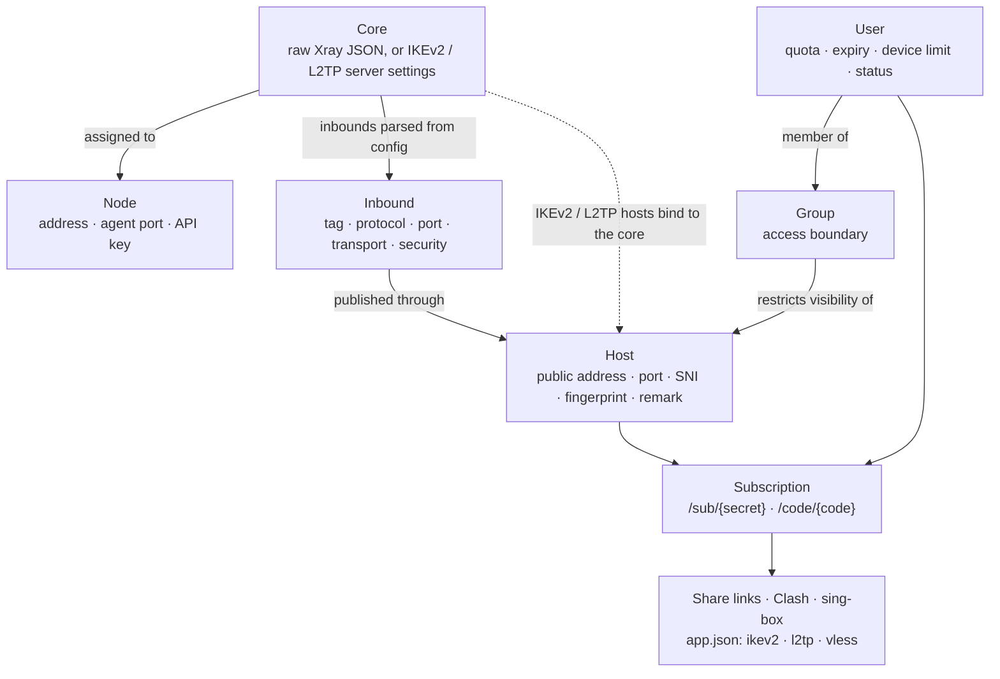

[→ صفحه‌ی اصلی](../../README.fa.md) · 📦 [نصب](installation.md) · 🌐 [نودها](nodes.md) · ⚛️ **هسته‌ها و هاست‌ها** · 👤 [کاربران](users-and-subscriptions.md) · 💼 [نمایندگان](resellers.md) · 🚇 [تانل‌ها](tunnels.md) · 🛡️ [سپر اتصال](connection-shield.md) · ✈️ [ربات تلگرام](telegram-bot.md) · 📱 [اپ اندروید](android-app.md) · 📶 [سلامت شبکه](network-health.md) · 🎛️ [مدیریت](operations.md) · 🚢 [مرجع استقرار](deployment.md) · 📐 [معماری](architecture.md) · 💻 [توسعه](development.md)

# هسته‌ها، هاست‌ها و گروه‌ها

## مدل پیکربندی

## هسته‌ها

هسته فناوری سمت سروری است که روی نود اجرا می‌شود و یکی از سه نوع زیر است:

| نوع | محتوا |
| --- | --- |
| `xray` | یک پیکربندی کامل Xray به‌صورت JSON، دقیقاً همان چیزی که `xray run -c` می‌پذیرد، همراه با ویرایشگرهای ساخت‌یافته برای routing، outbounds و DNS. inboundهای آن استخراج شده و برای هاست‌ها و گروه‌ها قابل انتخاب می‌شوند. |
| `ikev2` | پارامترهای سرور IKEv2/IPsec: حالت احراز هویت (EAP-MSCHAPv2 یا PSK)، شناسه‌ی راه دور (Remote ID) و گواهی سرور. |
| `l2tp` | پارامترهای سرور L2TP/IPsec، از جمله PSK مشترک. |

هر هسته را می‌توان به یک یا چند نود تخصیص داد. هر نود هم‌زمان یک هسته‌ی Xray و یک هسته‌ی IPsec دارد؛ بخش [دو هسته روی یک نود](nodes.md) را ببینید.

## هاست‌ها

هاست نقطه‌ی اتصال عمومی است که کلاینت دریافت می‌کند: نشانی، پورت و نام نمایشی، برای VLESS، VMess، Trojan، Shadowsocks، Hysteria2، L2TP و IKEv2.

- **پروتکل‌های Xray** به یک inbound استخراج‌شده از پیکربندی هسته ارجاع می‌دهند و پارامترهای transport، security و REALITY را از آن به ارث می‌برند. SNI، ALPN، fingerprint، path و security را می‌توان برای کلاینت‌ها بازنویسی کرد.
- هاست‌های **L2TP** به یک هسته‌ی `l2tp` متصل می‌شوند و از PSK مشترک آن استفاده می‌کنند.
- هاست‌های **IKEv2** به یک هسته‌ی `ikev2` متصل می‌شوند. سرور با گواهی X.509 (به‌طور پیش‌فرض خودامضا، یا زنجیره‌ی صادرشده توسط CA) و هر کاربر با EAP-MSCHAPv2 احراز هویت می‌شود.
- هاست‌های **Hysteria2** پارامترهای خود را نگه می‌دارند، زیرا Hysteria2 بیرون از نودها اجرا می‌شود.

### یافتن بهترین تارگت REALITY

دکمه‌ی **پیدا کردن بهترین تارگت (SNI)** در بخش REALITY فرم هسته‌ی Xray، اسکنر را باز می‌کند. اسکن روی نودی که انتخاب می‌کنید انجام می‌شود، چون نود است که handshake را به تارگت می‌فرستد.

هیچ فهرست آماده‌ای در کار نیست: تارگتی که در سورس یک پنل منتشر شود، اولین چیزی است که فیلترچی می‌بندد، و اسمی که روی شبکه‌ی یک سرور عالی است روی سرور دیگر معمولی است. هر اسکن اسم‌هایش را زنده پیدا می‌کند و هر بار یک محدوده جلوتر می‌رود، پس زدن دوباره‌ی دکمه سایت‌هایی می‌آورد که دور قبل نشان نداده بود.

1. **پیدا کردن** — نود اسم سایت‌ها را از گواهی TLS همه‌ی IPهای یک /24 نزدیک خودش می‌خواند. دور ۱ همان /24 خود نود است، دور ۲ /24های دو طرف آن و همین‌طور جلوتر؛ اسم‌هایی که در دورهای قبل پیدا شده‌اند رد می‌شوند.
2. **بررسی** — هر سایت باید TLS 1.3 و HTTP/2 و گواهی معتبر برای همان اسم داشته باشد و DNS خودش هم باید به همان IP برگردد که رویش پیدا شده. همسایه‌ها با IP خودشان وصل می‌شوند و همان IP به‌عنوان `dest` (`IP:443`) گذاشته می‌شود. سپس هر بازمانده از روی نود، با IP و بدون DNS، بعد از پایان بررسی‌ها و یکی‌یکی زمان‌سنجی می‌شود: **ping** میانه‌ی ۵ اتصال TCP و **TLS** میانه‌ی ۳ هندشیک کامل است.
3. **ایران** — از سرورهای تست داخل ایران (تهران، اصفهان، شیراز و قم، از طریق check-host.net) خواسته می‌شود هر بازمانده و آدرس خود نود را باز کنند. فقط اسم سایت یا آدرس نود فرستاده می‌شود. این یک دروازه است نه یک برچسب: اسمی که از *همه‌ی* شهرهای جواب‌داده باز نباشد حذف می‌شود، چون هر امتیاز دیگری هم بگیرد قابل استفاده نیست. هر شهر زمان پاسخش را هم می‌دهد و میانه‌ی آن‌ها سیگنال سرعت اسکن است — خیلی از اسم‌ها از ایران باز هستند ولی کند، و تارگت کند یعنی تونل کند.
4. **اثبات** — همان چند اسمی که از ایران باز بودند، از سریع‌ترین به بعد، روی نود یک سرور و کلاینت REALITY واقعی می‌گیرند و با هر fingerprint (chrome، firefox، safari، ios، android، edge، 360، qq، random، randomized) یک صفحه را از داخل آن باز می‌کنند. ✓ یعنی با آن fingerprint واقعاً وصل شد. fingerprintها هم از سریع‌ترین چیده می‌شوند و زمان هرکدام کنارش می‌آید.
5. **تست زیر بار** — همان چند تا بعد به همان شکلی زیر بار می‌روند که REALITY واقعاً از تارگت استفاده می‌کند: برای هر اتصال جدید کاربر یک هندشیک کامل به تارگت فرستاده می‌شود، یعنی نود تمام روز در آن را می‌زند. بیشتر همسایه‌ها سرورهای کوچک‌اند (سیستم تلفن، ERP یک شرکت) که پشتشان rate limiter است؛ این‌ها خیلی قبل از اینکه ایران چیزی ببندد نود را رد می‌کنند — و آن‌وقت هر اتصال جدید می‌شکند در حالی که بقیه‌ی چک‌ها همه سبزند. نود ۲۰ هندشیک همزمان می‌فرستد، بعد ۱۵ ثانیه ثانیه‌ای ۳ تا، بعد مکث و ۳ تای دیگر. فقط موفق یا ناموفق بودن هر هندشیک ثبت می‌شود و به شکل *پایدار زیر بار ۱۰۰٪* نشان داده می‌شود — زمان‌سنجی هندشیک‌های همزمان از روی نود، CPU خود نود را می‌سنجد نه تارگت را؛ تارگتی که بعد از مکث جواب ندهد به‌عنوان «نود را بست» علامت می‌خورد و ته فهرست می‌رود. نرخ‌ها عمداً خیلی کمتر از استفاده‌ی واقعی‌اند: آنقدر که rate limiter لو برود، نه اینکه خودش یکی باشد.
6. **تست از همین دستگاه** — پروب‌های check-host همه روی دیتاسنترند، پس اسمی که آن‌ها باز می‌بینند ممکن است روی اپراتور موبایل بسته باشد. با VPN خاموش، اسکنر می‌تواند از مرورگری که با آن کار می‌کنید، روی همان اینترنتی که وصل هستید، به هر سایت نهایی وصل شود؛ پنل اپراتور را از روی IP شما تشخیص می‌دهد (همراه اول، ایرانسل، مخابرات…) و نتیجه را با اسم آن ثبت می‌کند، یا اگر IP مال اپراتور ایرانی نباشد هشدار می‌دهد. اینترنت را عوض کنید و دوباره بزنید تا نتیجه‌ی اپراتور دیگر کنار اولی بیاید. مرورگر به خود سایت وصل می‌شود نه به نود با SNI دلخواه، پس این می‌گوید اپراتورتان این اسم را می‌بندد یا نه، نه اینکه سرعت تونل چقدر است.
7. **تست از ایران** — اندازه‌گیری قطعی سرعت، که با تمام شدن اسکن خودکار شروع می‌شود. فیلترینگ ایران روی اسم‌هایی که نمی‌بندد هم سرعت می‌گذارد، پس هیچ تستی از بیرون ایران نمی‌تواند تارگت‌ها را بر اساس سرعتی که کاربر می‌بیند مرتب کند. نود برای هر تارگت یک inbound موقت REALITY به مدت ۳۰ دقیقه باز می‌کند؛ لینک ساب را روی گوشی با اینترنت ایران وارد کنید، از هر کانفیگ speed test بگیرید، و سرعت واقعی دانلود و آپلود هر تارگت در پنل می‌آید، سریع‌ترین بالا. کنار هر نتیجه نوشته می‌شود اتصال‌ها از کدام اپراتور بوده‌اند.
8. **پیدا کردن الگوی اپراتور** — برای حالتی که روی یک اپراتور خوب است و روی دیگری نه. پنل یک لینک ساب می‌سازد که هر کانفیگش فقط در یک چیز با دیگری فرق دارد: بهترین SNI روی پورت تصادفی و روی پورت‌های استاندارد HTTPS (2053، 8443)، دامنه‌ی خودتان به‌عنوان SNI — اگر یکی از اسم‌های هاست‌هایتان به IP نود برسد و آنجا TLS 1.3 سرو کند، که تنها SNI بدون ناهمخوانی IP و SNI است — و دومین SNI خوب. روی گوشی با همان اپراتور تست کنید؛ پنل نتیجه‌ها را مقایسه می‌کند و الگو را می‌گوید: پورت، ناهمخوانی IP و SNI، یا خود IP و مسیر که هیچ SNIای درستش نمی‌کند و راه‌حلش رله‌ی داخل ایران یا CDN است.

مرتب‌سازی بر اساس این است که تارگت تا وقتی باز است چقدر خوب کار می‌کند، نه اینکه فقط وصل شود: اول کار کردن با chrome، بعد پایداری زیر بار، بعد سرعت پاسخ از ایران، بعد هندشیک نود تا تارگت.

دکمه‌ی **انتخاب** اسم را در `serverNames` و `dest` را در JSON هسته می‌گذارد. اسکنر به نود نسخه‌ی 1.4.2 یا جدیدتر نیاز دارد که Xray 26 هم دارد؛ روی Xray 1.8 اتصال REALITY با fingerprintهای chrome، firefox و safari کار نمی‌کند.

## گروه‌ها

گروه‌ها کنترل دسترسی واقعی‌اند، نه صرفاً دسته‌بندی. هاست یا inbound بدون گروه برای همه‌ی کاربران قابل مشاهده است. پس از اتصال به یک یا چند گروه، فقط برای اعضای همان گروه‌ها در اشتراک و در پیکربندی نود درج می‌شود؛ بنابراین عضویت در گروه هم لینک‌های دریافتی کاربر و هم اعتبارنامه‌های ارسالی به نودها را تعیین می‌کند.

---

[→ نودها](nodes.md) · [کاربران ←](users-and-subscriptions.md)

