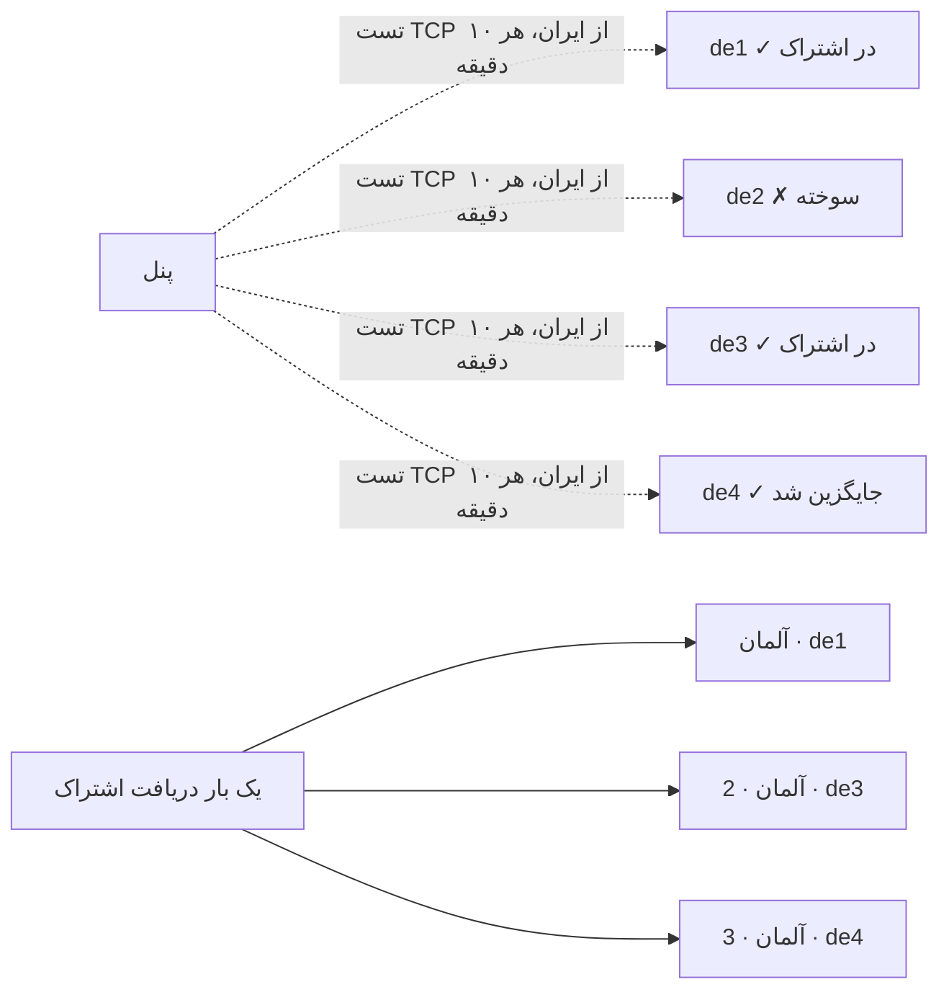

[→ صفحه‌ی اصلی](../../README.fa.md) · 📦 [نصب](installation.md) · 🌐 [نودها](nodes.md) · ⚛️ [هسته‌ها و هاست‌ها](cores-and-hosts.md) · 👤 [کاربران](users-and-subscriptions.md) · 💼 [نمایندگان](resellers.md) · 🚇 [تانل‌ها](tunnels.md) · 🛡️ [سپر اتصال](connection-shield.md) · 🔀 **چرخش دامنه** · ✈️ [ربات تلگرام](telegram-bot.md) · 📶 [سلامت شبکه](network-health.md) · 🎛️ [مدیریت](operations.md) · 🔁 [به‌روزرسانی امن](updates-and-rollback.md) · 🚢 [مرجع استقرار](deployment.md) · 📐 [معماری](architecture.md) · 💻 [توسعه](development.md)

# چرخش دامنه

هر دامنه‌ای ممکن است هر لحظه در ایران فیلتر شود. کلاینت‌های استوری — v2rayNG، V2Box، Streisand — همان یک آدرس اشتراکی را که به آن‌ها داده شده نگه می‌دارند و هیچ راه استانداردی برای یاد گرفتن آدرس دیگر ندارند؛ پس وقتی یک اسم فیلتر شد، هر تغییری که پنل بعداً بدهد به آن‌ها نمی‌رسد. چرخش دامنه این مشکل را در دو لایه حل می‌کند و هر دو **داخل همان اشتراکی که کاربر از قبل دارد** می‌روند:

| لایه | چه می‌کند | در کدام کلاینت‌ها |
| --- | --- | --- |
| **استخر دامنه** | هر هاست عضو استخر هم‌زمان با چند دامنه‌ی سالم در اشتراک می‌رود. اگر یکی فیلتر شود، کانفیگ‌های بقیه از قبل روی گوشی هستند. | همه‌ی کلاینت‌ها |
| **آدرس‌های پشتیبان داخل اشتراک** | آدرس‌های دیگر خود اشتراک داخل بدنه‌اش قرار می‌گیرند. | Clash/Mihomo خودشان از آن‌ها می‌گیرند؛ v2rayNG/V2Box آن‌ها را به‌شکل یک ردیف اطلاعاتی نشان می‌دهند |

فقط چیزی که از اشتراک می‌آید می‌چرخد: VLESS، VMess، Trojan، Shadowsocks و Hysteria2. IKEv2، L2TP و PPTP دستی روی گوشی تنظیم می‌شوند و WireGuard یک فایل `.conf` است؛ برای همین پنل اجازه نمی‌دهد به استخر وصل شوند و آدرسشان هیچ‌وقت عوض نمی‌شود.

## استخر دامنه

**هاست‌ها ← 🌐 استخر دامنه‌ها.** استخر فهرستی از آدرس‌های جایگزین‌پذیر برای همان سرورهاست، به ترتیب اولویت.

| تنظیم | کاربرد |
| --- | --- |
| نوع | **مستقیم**: هر اسم به خود سرور اشاره می‌کند (A/AAAA/CNAME). **CDN**: هر اسم از طریق آروان، کلادفلر یا CDN دیگر به همان مبدأ می‌رسد؛ آی‌پی تمیز هم قبول است. |
| تعداد کانفیگ هر هاست | چند دامنه‌ی سالم هم‌زمان در هر اشتراک برود (پیش‌فرض ۳). بقیه رزرو می‌مانند. |
| پورت تست از ایران | پورت TCP که روی هر دامنه تست می‌شود (پیش‌فرض 443). |
| تعداد تست ناموفق پشت سر هم | بعد از این تعداد تست ناموفق، دامنه سوخته می‌شود (پیش‌فرض ۳)؛ با همین تعداد تست موفق برمی‌گردد. |

بعد روی هاست، استخر را انتخاب کنید (فیلد **استخر دامنه** در فرم هاست). هاست به ازای هر دامنه‌ی فعال یک بار در اشتراک می‌رود — `آلمان`، `آلمان · 2`، `آلمان · 3` — و آدرسی که روی خود هاست نوشته شده فقط وقتی استفاده می‌شود که استخر هیچ دامنه‌ی سالمی نداشته باشد؛ هاست هیچ‌وقت از اشتراک‌ها حذف نمی‌شود.

### چه چیزی در هر نسخه عوض می‌شود

- **آدرس** همیشه دامنه‌ی استخر می‌شود.
- **نام TLS (SNI)** و **هدر Host** اگر همان آدرس خود هاست بودند همراهش عوض می‌شوند، و در استخر CDN اگر خالی بودند هم (CDN با همین‌ها مسیریابی می‌کند).
- اسم‌هایی که عمداً چیز دیگری گذاشته شده‌اند دست نمی‌خورند — مثلاً هاستی که به یک لبه‌ی تمیز (`snapp.ir`) وصل می‌شود ولی اسم واقعی را در SNI و Host می‌فرستد، همان اسم را روی همه‌ی نسخه‌ها نگه می‌دارد.

در استخر مستقیم با TLS، گواهی سرور باید همه‌ی اسم‌های استخر را پوشش دهد.

### سلامت و چرخش

پنل هر ۱۰ دقیقه از نودهای ایرانی check-host.net می‌خواهد به هر دامنه روی پورت تست اتصال TCP باز کنند. دامنه‌ای که بیشترشان به آن برسند سالم است. این دو روش معمول از کار افتادن اسم در ایران را می‌گیرد — جواب DNS مسموم یا آدرس مسدود؛ مسدود شدن بر اساس SNI در حالی که آدرس در دسترس است، با تست TCP دیده نمی‌شود.

1. دامنه‌ای که به تعداد تعیین‌شده پشت سر هم تست را رد کند **سوخته** می‌شود و از اشتراک‌ها بیرون می‌رود؛ دامنه‌ی رزرو بعدی به ترتیب استخر، در دریافت بعدی جایش را می‌گیرد.
2. دامنه‌ی سوخته‌ای که به همان تعداد پشت سر هم تست را پاس کند برمی‌گردد.
3. وقتی دامنه‌های سالم از تعدادی که استخر پخش می‌کند کمتر شوند، یک بار اعلان **«دامنه‌ی سالم کم مانده»** فرستاده می‌شود.
4. هر سوختن، برگشت و اعلان زیر استخر ثبت و به اعلان‌های تلگرام، دیسکورد و وب‌هوک تنظیمات فرستاده می‌شود.

دکمه‌های استخر: **تست از ایران** (حدود پانزده ثانیه)، **سوزاندن** دامنه‌ای که می‌دانید فیلتر است، **برگرداندن**، **غیرفعال** (نه تست می‌شود نه پخش)، **ویرایش** (ترتیب دامنه‌ها همان ترتیب اولویت است؛ دامنه‌ای که بماند وضعیتش را نگه می‌دارد)، **حذف** (هاست‌ها به آدرس خودشان برمی‌گردند).

### کاربر چه می‌بیند

- **v2rayNG، V2Box، Streisand**: نسخه‌ها به‌صورت کانفیگ‌های جدا. وقتی یکی وصل نشد، کاربر یکی دیگر را انتخاب می‌کند — بدون آپدیت اشتراک. در آپدیت بعدی دامنه‌ی سوخته جایگزین می‌شود.
- **Clash / Mihomo**: نسخه‌ها در گروه url-test به نام `auto`، که خودش به نسخه‌ی سالم می‌رود.
- **sing-box (SFA، SFI، Hiddify)**: یک خروجی urltest به نام `auto` روی همه‌ی کانفیگ‌ها که پیش‌فرض انتخاب شده و همین کار را می‌کند.

## آدرس‌های پشتیبان داخل اشتراک

دامنه‌های پشتیبان اشتراک در **تنظیمات ← دامنه‌های اشتراک** هستند: اسم‌هایی که به پنل اشاره می‌کنند، هرکدام با گواهی خودش، از ایران تست می‌شوند و (اختیاری) وقتی دامنه‌ی اصلی از کار بیفتد خودکار جایش را می‌گیرند. به‌طور پیش‌فرض مخفی‌اند — فقط اپ تیفوسی آن‌ها را از `app.json` یاد می‌گیرد.

**تزریق داخل خود اشتراک** آن‌ها را داخل بدنه‌ی اشتراک می‌گذارد:

- **Clash / Mihomo**: هر آدرس (دامنه‌ی اصلی و همه‌ی پشتیبان‌های دارای گواهی، به‌جز آدرسی که همین درخواست از آن آمده) یک `proxy-provider` می‌شود. کلاینت خودش آن‌ها را می‌گیرد و تازه می‌کند؛ پس وقتی آدرسی که پروفایل با آن اضافه شده فیلتر شود، کانفیگ‌ها از پشتیبان می‌رسند و `auto` به آن‌ها می‌رود.
- **v2rayNG / V2Box**: برای هر آدرس یک ردیف اطلاعاتی؛ کانفیگی که وصل نمی‌شود و اسمش `📎 لینک پشتیبان اشتراک: https://…/sub/…` است. اشتراک base64 هیچ فیلدی برای آدرس اشتراک دیگر ندارد؛ این تنها جایی است که کاربر می‌تواند آن را ببیند.

این گزینه به‌طور پیش‌فرض خاموش است: وقتی روشن باشد، هر کسی که لینک اشتراک دارد دامنه‌های پشتیبان را می‌بیند، که طراحی مخفی در حالت عادی از آن پرهیز می‌کند.

## تنظیمات

تست برای همه‌ی استخرهای فعال هر ۱۰ دقیقه اجرا می‌شود. تست از خود پنل و با check-host.net انجام می‌شود؛ به آپدیت نود یا ایجنت نیازی نیست.

---

[→ سپر اتصال](connection-shield.md) · [ربات تلگرام ←](telegram-bot.md)

