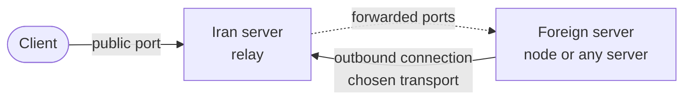

[→ صفحه‌ی اصلی](../../README.fa.md) · 📦 [نصب](installation.md) · 🌐 [نودها](nodes.md) · ⚛️ [هسته‌ها و هاست‌ها](cores-and-hosts.md) · 👤 [کاربران](users-and-subscriptions.md) · 💼 [نمایندگان](resellers.md) · 🚇 **تانل‌ها** · 🛡️ [سپر اتصال](connection-shield.md) · ✈️ [ربات تلگرام](telegram-bot.md) · 📱 [اپ اندروید](android-app.md) · 📶 [سلامت شبکه](network-health.md) · 🎛️ [مدیریت](operations.md) · 🚢 [مرجع استقرار](deployment.md) · 📐 [معماری](architecture.md) · 💻 [توسعه](development.md)

# تانل‌ها

تانل یک سرور خارج را از طریق یک سرور واسط در شبکه‌ی محدود (سرور ایران) منتشر می‌کند. کلاینت‌ها به سرور ایران وصل می‌شوند و سرور خارج خودش به سرور ایران اتصال برقرار می‌کند، بنابراین سرور خارج به هیچ پورت ورودی باز نیاز ندارد.

عامل تانل روی هر دو سرور به‌صورت سرویس مستقل اجرا می‌شود. پنل پیکربندی تانل را نگه می‌دارد و دستور نصب هر سمت را تولید می‌کند تا توکن و نقشه‌ی پورت‌ها دو بار تایپ نشوند؛ پس از نصب، پنل عامل را مدیریت نمی‌کند.

## ایجاد تانل

| تنظیم | کاربرد |
| --- | --- |
| نشانی و پورت سرور ایران | شنونده‌ی عمومی که کلاینت‌ها به آن وصل می‌شوند. پورت پیش‌فرض `8443` است. |
| سرور خارج | نودی که از قبل در پنل ثبت شده و نشانی آن استفاده می‌شود، یا هر سرور دیگری با نشانی آن. |
| ترنسپورت | روش اتصال سرور خارج به سرور ایران (جدول زیر). |
| SNI و دامنه | برای `tls`، `wss` و `wssmux`. برای دامنه می‌توان هنگام نصب گواهی Let's Encrypt گرفت. |
| مسیر (Path) | برای `ws`، `wss`، `wsmux` و `wssmux`. |
| تعداد اتصال | تعداد اتصال‌های فیزیکی که سرور خارج باز نگه می‌دارد. پیش‌فرض `8` است. |
| پورت‌های فوروارد | نگاشت‌های نام‌دار پورت، هر کدام TCP یا UDP، از یک پورت سرور ایران به یک پورت سرور خارج. |

برای هر تانل یک توکن به‌صورت خودکار ساخته می‌شود.

### ترنسپورت‌ها

فرم سه ترنسپورت پیشنهاد می‌دهد:

| ترنسپورت | کاربرد |
| --- | --- |
| **TCP چندگانه** (`tcpmux`) | سریع‌ترین؛ سرور خارج مستقیم به سرور ایران وصل می‌شود. |
| **WSS چندگانه** (`wssmux`) | WebSocket روی TLS. مقاوم‌ترین در برابر فیلترینگ و تنها گزینه‌ای که از CDN عبور می‌کند. |
| **UDP (KCP)** (`udp`) | برای مسیرهایی که TCP در آن‌ها اختلال دارد. |

تانل‌هایی که پیش‌تر با `tcp`، `tls`، `ws`، `wss` یا `wsmux` ساخته شده‌اند کار می‌کنند؛ هنگام ویرایش، ترنسپورتشان به‌صورت کارت «قدیمی» نمایش داده می‌شود.

## عبور از CDN

با انتخاب **WSS چندگانه**، گزینه‌ی **عبور از CDN** باعث می‌شود سرور خارج به‌جای IP سرور ایران به یک دامنه‌ی CDN وصل شود؛ در نتیجه اگر IP سرور ایران فیلتر شود، تانل قطع نمی‌شود. در ایران ابر آروان پیشنهاد می‌شود؛ Cloudflare هم پشتیبانی می‌شود.

۱. تیک **عبور از CDN** را بزنید، ابر آروان یا Cloudflare را انتخاب کرده و دامنه‌ای را که به سرور ایران اشاره می‌کند وارد کنید.

۲. پنل SNI را همان دامنه قرار می‌دهد، یک مسیر WebSocket تصادفی می‌سازد و پورت را تنظیم می‌کند: در آروان پورت تانل همان پورت مبدأ است؛ Cloudflare فقط پورت‌های 443، 2053، 2083، 2087، 2096 و 8443 را عبور می‌دهد و با همان پورت به سرور ایران وصل می‌شود، پس پورت تانل همان پورت انتخابی خواهد بود.

۳. چک‌لیست زیر فرم را انجام دهید: رکورد A به سرور ایران با پروکسی CDN روشن، اتصال HTTPS به مبدأ روی پورت تانل (در Cloudflare حالت SSL روی Full) و روشن بودن WebSocket.

۴. **تست اتصال** یک مرحله‌ی **مسیر CDN** اضافه می‌کند: پنل یک درخواست واقعی WebSocket از طریق CDN به سرور ایران می‌فرستد و فقط با پاسخ `101` آن را سبز می‌کند.

ابر آروان ترافیک عبوری را محاسبه می‌کند، پس هرچه از تانل رد شود هزینه دارد.

### کیفیت CDN

دکمه‌ی **⚡ کیفیت ابر آروان** روی کارت تانل CDN سه تست واقعی را باز می‌کند. اگر سرور خارج نود پنل باشد تست‌ها روی همان سرور (ماشینی که واقعاً به CDN وصل می‌شود) اجرا می‌شوند، وگرنه روی سرور پنل؛ پنجره می‌گوید کدام.

- **IP تمیز.** حدود ۱۲۸ نشانی لبه از رنج‌های منتشرشده‌ی CDN، هر کدام با یک درخواست واقعی WebSocket تا سرور ایران تست می‌شوند؛ ده‌تای سریع‌تر سه بار دیگر تست شده و با زمان میانه، نوسان و تعداد موفقیت نمایش داده می‌شوند. سه‌تای بهتر خودکار انتخاب می‌شوند. لبه‌های ذخیره‌شده به‌صورت `servers` در کانفیگ سرور خارج قرار می‌گیرند: تانل اتصال‌هایش را بین آن‌ها پخش می‌کند و لبه‌ای را که جواب ندهد رد می‌کند.
- **SNI جلو (Domain Fronting).** سایت‌های شناخته‌شده‌ی ایرانی resolve می‌شوند تا معلوم شود کدام واقعاً روی همین CDN هستند؛ سپس هر کدام به‌عنوان نام TLS تست می‌شود در حالی که `Host` درخواست WebSocket دامنه‌ی شماست. فقط سایت‌هایی که واقعاً اتصال را تا سرور ایران رساندند پیشنهاد می‌شوند.
- **تست سرعت واقعی.** ۸ مگابایت از سرور ایران، از داخل CDN و با پروتکل خود تانل، با همان لبه و SNI ذخیره‌شده دانلود می‌شود و سرعت (Mbps) و پینگ گزارش می‌شود. قبل و بعد از هر تغییر اجرا کنید.

بعد از **ذخیره**، دستور نصب سمت خارج نمایش داده می‌شود؛ یک بار روی سرور خارج اجرایش کنید تا لبه‌ها و SNI جدید اعمال شوند. تست سرعت به نسخه‌ی جدید برنامه‌ی تانل روی سرور ایران هم نیاز دارد، پس دستور نصب سمت ایران را هم یک بار دوباره اجرا کنید.

با زدن تیک CDN، فرم تعداد اتصال را از ۸ به ۱۶ می‌برد، چون CDN سرعت هر اتصال را جداگانه محدود می‌کند.

## انتخاب ترنسپورت

پیش از ایجاد تانل، گزینه‌ی **پیشنهاد بهترین ترنسپورت** هر دو سرور را بررسی کرده، دسترس‌پذیری و تأخیر هر کدام را گزارش می‌کند و ترنسپورت‌ها را رتبه‌بندی می‌کند. این رتبه‌بندی بر پایه‌ی چیزی است که از بیرون شبکه‌ی محدود واقعاً قابل اندازه‌گیری است و نمی‌تواند رفتار فیلترینگ با هر ترنسپورت را پیش‌بینی کند؛ بنابراین ترنسپورت انتخابی را پس از نصب آزمایش کنید.

## نصب و آزمایش

۱. تانل را باز کرده و دستور نصب هر سمت را کپی کنید.

۲. دستور سمت ایران را روی سرور ایران و دستور سمت خارج را روی سرور خارج اجرا کنید.

۳. گزینه‌ی **تست اتصال** را بزنید. پنل دسترسی به سرور ایران، سرور خارج و پورت عمومی تانل را بررسی کرده و وضعیت تانل را همراه با تأخیر و زمان بررسی، `connected` یا `error` ثبت می‌کند. تانل `udp` از بیرون قابل بررسی نیست؛ لاگ سرویس آن روی سرور ایران با `journalctl -u tifusi` خوانده می‌شود.

## تست IP Spoofing

برخی انواع تانل به این وابسته‌اند که دیتاسنتر سرور ایران اجازه دهد بسته‌هایی با نشانی مبدأ جعلی از شبکه‌اش خارج شوند. کارت **IP Spoofing** در بخش انتخاب ترنسپورت دو دستور، یکی برای هر سرور، تولید می‌کند که پیش از ساخت چنین تانلی این موضوع را بررسی می‌کنند. تا زمانی که دستورها روی سرورها اجرا نشوند، هیچ کاری روی آن‌ها انجام نمی‌شود.

## تانل و IKEv2 یا L2TP

برای عبور IKEv2 یا L2TP بومی از تانل، پورت‌های UDP 500 و 4500 را از سرور ایران به سرور خارج فوروارد کنید، و برای کلاینت‌های L2TP بدون IPsec پورت UDP 1701 را هم اضافه کنید. هاستی که برای کاربران منتشر می‌شود باید به نشانی سرور ایران اشاره کند.

---

[→ نمایندگان](resellers.md) · [سپر اتصال ←](connection-shield.md)

