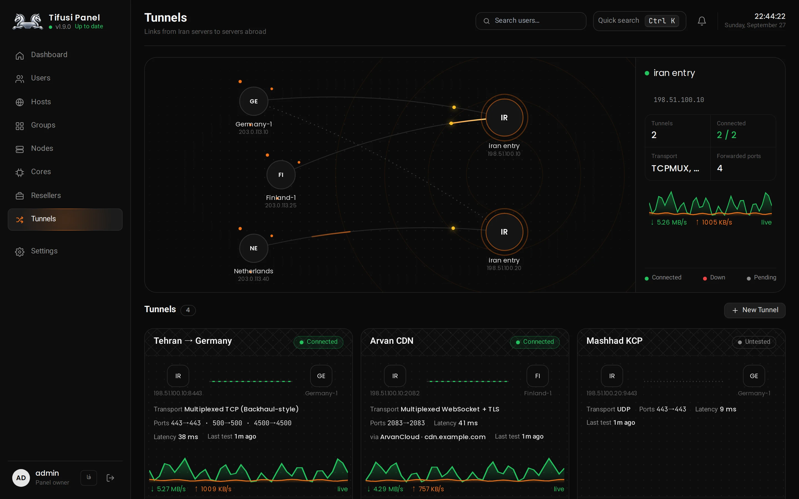

import { Card, CardGrid, Steps } from '@astrojs/starlight/components'

## Install on a server

```bash
bash -c "$(curl -fsSL https://raw.githubusercontent.com/javadtifusi-eng/Tifusi-Panel/main/install.sh)"
```

Run it as root on Ubuntu or Debian. Append `-- --pro` for the Pro edition with MySQL.

## The Tunnels page, live



<p class="shot-caption">Every tunnel is re-tested every 15 seconds and its traffic graph updates each second.</p>

## What you get

<CardGrid>
  <Card title="Two cores on one node" icon="rocket">
    Each node runs Xray (VLESS, VMess, Trojan, Shadowsocks) and IPsec (IKEv2 or L2TP) side by side, so one server serves proxy and native VPN users.
  </Card>
  <Card title="Iran-to-abroad tunnels" icon="random">
    Multiplexed TCP, multiplexed WSS, UDP over KCP and a spoof tunnel. The foreign server dials out, so it needs no open inbound port.
  </Card>
  <Card title="Through ArvanCloud" icon="star">
    Tunnels ride a CDN domain and survive the Iran IP being blocked. Clean-IP search, fronting SNI and a real speed test are built in.
  </Card>
  <Card title="Connection Shield" icon="approve-check">
    When an Iran relay gets blocked from abroad, users move to a standby relay in about two minutes, with no app update.
  </Card>
  <Card title="Device limits on the node" icon="setting">
    Concurrent Xray, IKEv2 and L2TP sessions are enforced on the node itself, not just counted in the panel.
  </Card>
  <Card title="Telegram bot and Android app" icon="telegram">
    Sell subscriptions automatically with Tifusi Bot and connect with one tap in Tifusi VPN.
  </Card>
</CardGrid>

## Up in three steps

<Steps>

1. **Install the panel** with the command above.

2. **Add a node.** Create it on the Nodes page and run the command the panel gives you on the foreign server.

3. **Build a tunnel.** Pick the Iran and foreign servers on the Tunnels page and run each side's install command. [Full tunnels guide](guides/tunnels/)

</Steps>

## License

Tifusi Panel's code is public but not open source. You may install and use it for your own servers; copying, modifying, redistributing, rebranding or selling it without written permission is not allowed. [License text](https://github.com/javadtifusi-eng/Tifusi-Panel/blob/main/LICENSE)
