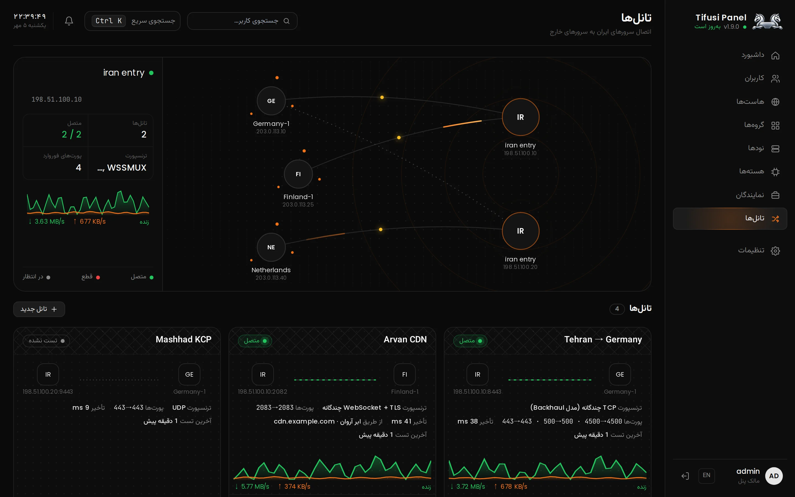

import { Card, CardGrid, Steps } from '@astrojs/starlight/components'

## نصب روی سرور

<div class="install">

```bash
bash -c "$(curl -fsSL https://raw.githubusercontent.com/javadtifusi-eng/Tifusi-Panel/main/install.sh)"
```

</div>

با کاربر root روی Ubuntu یا Debian اجرا کنید. برای نسخه‌ی حرفه‌ای با MySQL، `-- --pro` را به آخر دستور اضافه کنید.

## بخش تانل‌ها، زنده



<p class="shot-caption">هر تانل هر ۱۵ ثانیه تست می‌شود و نمودار ترافیک هر ثانیه به‌روز می‌شود.</p>

## چه چیزهایی در اختیارتان می‌گذارد

<CardGrid>
  <Card title="دو هسته روی یک نود" icon="rocket">
    هر نود هم‌زمان Xray (VLESS، VMess، Trojan، Shadowsocks) و IPsec (IKEv2 یا L2TP) اجرا می‌کند؛ یک سرور هم پروکسی می‌دهد هم VPN بومی.
  </Card>
  <Card title="تانل ایران به خارج" icon="random">
    TCP چندگانه، WSS چندگانه، UDP با KCP و تانل Spoof. سرور خارج خودش وصل می‌شود و پورت ورودی باز نمی‌خواهد.
  </Card>
  <Card title="عبور از ابر آروان" icon="star">
    تانل روی دامنه‌ی CDN؛ اگر IP ایران فیلتر شود قطع نمی‌شود. پیدا کردن IP تمیز، SNI جلو و تست سرعت واقعی داخل پنل.
  </Card>
  <Card title="سپر اتصال" icon="approve-check">
    وقتی رله‌ی ایران ایران‌اکسس شود، کاربرها در حدود دو دقیقه به رله‌ی جانشین می‌روند، بدون آپدیت در گوشی.
  </Card>
  <Card title="محدودیت دستگاه روی نود" icon="setting">
    اتصال هم‌زمان Xray، IKEv2 و L2TP روی خود نود کنترل می‌شود، نه فقط در پنل.
  </Card>
  <Card title="ربات تلگرام و اپ اندروید" icon="telegram">
    فروش خودکار اشتراک با Tifusi Bot و اتصال با یک لمس در Tifusi VPN.
  </Card>
</CardGrid>

## راه‌اندازی در سه قدم

<Steps>

1. **نصب پنل.** یک دستور بالا روی سرور پنل.

2. **افزودن نود.** نود را در صفحه‌ی نودها بسازید و دستوری را که پنل می‌دهد روی سرور خارج اجرا کنید.

3. **ساخت تانل.** در صفحه‌ی تانل‌ها سرور ایران و خارج را انتخاب کنید و دستور نصب هر سمت را اجرا کنید. [راهنمای کامل تانل‌ها](guides/tunnels/)

</Steps>

## مجوز

کد تیفوسی پنل عمومی است ولی متن‌باز نیست. نصب و استفاده برای سرورهای خودتان آزاد است؛ کپی، تغییر و انتشار دوباره، تغییر نام و فروش بدون اجازه‌ی کتبی ممنوع است. [متن مجوز](https://github.com/javadtifusi-eng/Tifusi-Panel/blob/main/LICENSE)
